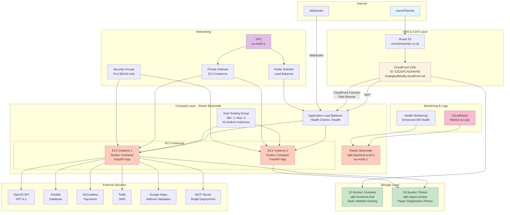
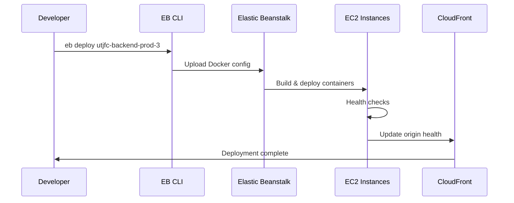

# AWS Architecture Overview - UTJFC Registration System

## 🏗️ Complete AWS Infrastructure Stack

### Architecture Diagram



## 📊 AWS Services Breakdown

### 1. **Content Delivery & DNS**

| Service | Purpose | Configuration |
|---------|---------|---------------|
| **Route 53** | DNS Management | urmstontownjfc.co.uk → CloudFront |
| **CloudFront** | Global CDN | Distribution ID: E2QSITLN2AAV5D |
| **CloudFront Function** | URL Rewriting | Removes `/api` prefix for backend |

### 2. **Storage Services**

| Bucket | Purpose | Key Features |
|--------|---------|--------------|
| **utjfc-frontend-chat** | Frontend hosting | Static website hosting enabled |
| **utjfc-player-photos** | Photo storage | HEIC conversion, public read access |

### 3. **Compute Services**

| Service | Configuration | Details |
|---------|---------------|---------|
| **Elastic Beanstalk** | Platform: Docker on Amazon Linux 2 | Environment: utjfc-backend-prod-3 |
| **EC2 Instances** | Type: t3.medium | Auto-scaling 1-3 instances |
| **Load Balancer** | Application Load Balancer | Health endpoint: /health |
| **Auto Scaling** | CPU/Memory based | Scale up at 70%, down at 30% |

### 4. **Networking**

| Component | Configuration | Security |
|-----------|---------------|----------|
| **VPC** | Region: eu-north-1 | Default VPC configuration |
| **Subnets** | Private: EC2, Public: ALB | Multi-AZ deployment |
| **Security Groups** | Ingress: 80/443 only | Restrictive rules |

### 5. **Monitoring & Operations**

| Service | Usage | Cost |
|---------|-------|------|
| **CloudWatch** | Basic metrics (free tier) | ~$0/month |
| **EB Health** | Enhanced monitoring | Included |
| **Logs** | Application logs | Minimal storage costs |

## 💰 Cost Breakdown (Estimated Monthly)

| Service | Usage | Estimated Cost |
|---------|-------|----------------|
| **Elastic Beanstalk** | 1 x t3.medium (24/7) | ~$34/month |
| **CloudFront** | Low traffic CDN | ~$5/month |
| **S3 Storage** | <50GB total | ~$2/month |
| **Data Transfer** | Minimal | ~$5/month |
| **CloudWatch** | Free tier | $0/month |
| **Total** | **Infrastructure** | **~$46/month** |

*Note: Costs vary with usage. External services (OpenAI, Twilio, etc.) billed separately.*

## 🚀 Deployment Flow



## 🔑 Key Infrastructure Details

### Production Environment
```yaml
Environment: utjfc-backend-prod-3
Platform: Docker running on 64bit Amazon Linux 2
Region: eu-north-1 (Stockholm)
URL: utjfc-backend-prod-3.eba-3bpsyeak.eu-north-1.elasticbeanstalk.com
Instance Type: t3.medium
Auto Scaling: 1-3 instances
Deployment: Rolling with batch size 1
```

### CloudFront Configuration
```yaml
Distribution ID: E2QSITLN2AAV5D
Domain: d1ahgtos8kkd8y.cloudfront.net
Origins:
  - S3: utjfc-frontend-chat (default)
  - EB: utjfc-backend-prod-3 (for /api/*)
SSL: CloudFront default certificate
Caching:
  - Frontend: 24 hours
  - API: No caching
```

### S3 Buckets
```yaml
Frontend Bucket: utjfc-frontend-chat
  - Static website hosting: Enabled
  - Index document: index.html
  - Error document: 404.html
  - Public access: Read only

Photos Bucket: utjfc-player-photos
  - Versioning: Disabled
  - Lifecycle: None (manual cleanup)
  - Access: Public read via CloudFront
```

## 🔒 Security Configuration

### Network Security
- **VPC**: Default VPC with standard configuration
- **Security Groups**: 
  - Inbound: HTTP (80) from ALB only
  - Outbound: HTTPS (443) to anywhere
- **IAM Roles**: 
  - EC2 instance role for S3 access
  - No hardcoded credentials

### Application Security
- **Environment Variables**: Stored in EB configuration
- **Secrets**: Never in code, always in environment
- **HTTPS**: Enforced via CloudFront
- **CORS**: Configured for frontend domain only

## 📝 AWS CLI Commands Reference

### Common Operations
```bash
# Check environment health
aws elasticbeanstalk describe-environments \
  --environment-names utjfc-backend-prod-3 \
  --profile footballclub

# View recent events
aws elasticbeanstalk describe-events \
  --environment-name utjfc-backend-prod-3 \
  --max-records 20 \
  --profile footballclub

# Update CloudFront distribution
aws cloudfront get-distribution-config \
  --id E2QSITLN2AAV5D \
  --profile footballclub > cloudfront-config.json

# List S3 photos
aws s3 ls s3://utjfc-player-photos/ \
  --profile footballclub

# Sync frontend to S3
aws s3 sync ./out s3://utjfc-frontend-chat \
  --delete \
  --profile footballclub
```

## 🎯 Architecture Highlights

1. **Serverless Frontend**: S3 + CloudFront for zero-maintenance hosting
2. **Containerized Backend**: Docker on Elastic Beanstalk for easy deployment
3. **Auto-scaling**: Handles registration period traffic spikes
4. **Global CDN**: Fast loading worldwide via CloudFront
5. **Managed Services**: Minimal operational overhead
6. **Cost Optimized**: ~$46/month for complete infrastructure

## 🔄 Disaster Recovery

- **RTO (Recovery Time Objective)**: 15-25 minutes
- **RPO (Recovery Point Objective)**: Near zero (external services store data)
- **Backup Strategy**: 
  - Code in Git
  - Data in Airtable (external)
  - Photos in S3 (durable storage)
- **Recovery Process**: Simple redeployment via EB CLI

This architecture provides a robust, scalable, and cost-effective solution for the UTJFC registration system, perfectly sized for a football club's needs while maintaining professional standards.