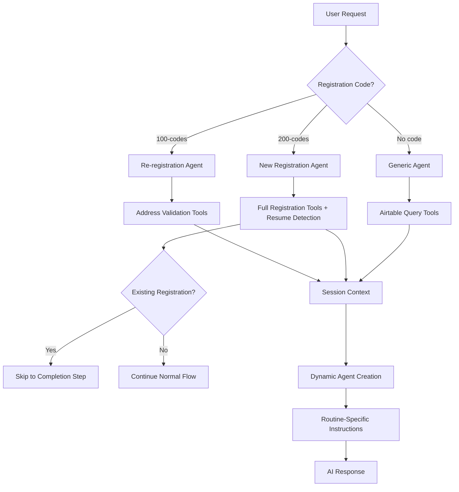

# Agent Orchestration Low-Level Design (LLD)
## UTJFC Backend Multi-Agent System

### Table of Contents
1. [Architecture Overview](#architecture-overview)
2. [Base Agent Class Implementation](#base-agent-class-implementation)
3. [Registration Agent Specialization](#registration-agent-specialization)
4. [Agent Switching Logic](#agent-switching-logic)
5. [Dynamic Agent Creation](#dynamic-agent-creation)
6. [Context Management](#context-management)
7. [MCP vs Local Execution Modes](#mcp-vs-local-execution-modes)
8. [Registration Code Routing](#registration-code-routing)
9. [Workflow Orchestration](#workflow-orchestration)
10. [Session Continuity](#session-continuity)
11. [Tool Integration](#tool-integration)
12. [Error Handling & Fallbacks](#error-handling--fallbacks)
13. [Performance Considerations](#performance-considerations)

---

## Architecture Overview

### Multi-Agent System Design
The UTJFC backend implements a sophisticated multi-agent orchestration system that intelligently routes conversations between specialized agents while maintaining conversation context and state. The system supports multiple execution modes and dynamic agent creation based on workflow requirements.



### Agent Hierarchy
1. **Base Agent Class** (`urmston_town_agent/agents.py`)
2. **Specialized Registration Agent** (`registration_agent/agents_reg.py`)
3. **Agent Instances** (`registration_agent/registration_agents.py`)

---

## Base Agent Class Implementation

### Core Agent Class (`urmston_town_agent/agents.py:8-76`)

#### Agent Data Model
```python
class Agent(BaseModel):
    name: str = "Agent"
    model: str = "gpt-4o-mini"
    instructions: str = "You are a helpful Agent"
    tools: list = []                    # Tool function names
    use_mcp: bool = False               # Local vs MCP execution
    mcp_server_url: str = ""            # MCP server endpoint
```

#### Dual Execution Mode Support
```python
def get_tools_for_openai(self):
    """
    Get tools formatted for OpenAI API calls.
    Returns either local function definitions or MCP server configuration.
    """
    if self.use_mcp and self.mcp_server_url:
        # MCP mode: Return server configuration
        return [{
            "type": "mcp",
            "server_label": "utjfc_registration",
            "server_url": self.mcp_server_url,
            "require_approval": "never",
            "allowed_tools": self.tools if self.tools else None
        }]
    else:
        # Local mode: Return function definitions
        available_tools = {
            "airtable_database_operation": AIRTABLE_DATABASE_OPERATION_TOOL
        }
        
        openai_tools = []
        for tool_name in self.tools:
            if tool_name in available_tools:
                openai_tools.append(available_tools[tool_name])
        
        return openai_tools
```

#### Local Function Mapping
```python
def get_tool_functions(self):
    """
    Get Python functions for local tool execution.
    Only used when use_mcp=False.
    """
    if self.use_mcp:
        return {}  # MCP mode doesn't use local functions
        
    return {
        "airtable_database_operation": handle_airtable_tool_call
    }
```

#### MCP Agent Factory
```python
@classmethod
def create_mcp_agent(cls, name: str, instructions: str, mcp_server_url: str = None):
    """Factory method for MCP-enabled agents."""
    if not mcp_server_url:
        mcp_server_url = os.getenv("MCP_SERVER_URL", "http://localhost:8002/sse")
    
    return cls(
        name=name,
        model="gpt-4.1",  # MCP requires gpt-4.1+
        instructions=instructions,
        tools=["airtable_database_operation"],
        use_mcp=True,
        mcp_server_url=mcp_server_url
    )
```

---

## Registration Agent Specialization

### Enhanced Agent Class (`registration_agent/agents_reg.py`)

#### Extended Tool Ecosystem
```python
available_tools = {
    # Core tools
    "airtable_database_operation": AIRTABLE_DATABASE_OPERATION_TOOL,
    
    # Validation tools
    "person_name_validation": PERSON_NAME_VALIDATION_TOOL,
    "child_dob_validation": CHILD_DOB_VALIDATION_TOOL,
    "medical_issues_validation": MEDICAL_ISSUES_VALIDATION_TOOL,
    "address_validation": ADDRESS_VALIDATION_TOOL,
    "address_lookup": ADDRESS_LOOKUP_TOOL,
    
    # Payment tools
    "create_signup_payment_link": CREATE_SIGNUP_PAYMENT_LINK_TOOL,
    "create_payment_token": CREATE_PAYMENT_TOKEN_TOOL,
    
    # Database tools
    "update_reg_details_to_db": UPDATE_REG_DETAILS_TO_DB_AI_FRIENDLY_TOOL,
    "update_kit_details_to_db": UPDATE_KIT_DETAILS_TO_DB_TOOL,
    "update_photo_link_to_db": UPDATE_PHOTO_LINK_SCHEMA,
    
    # Registration tools
    "check_shirt_number_availability": CHECK_SHIRT_NUMBER_AVAILABILITY_TOOL,
    "check_if_kit_needed": CHECK_IF_KIT_NEEDED_TOOL,
    
    # File tools
    "upload_photo_to_s3": UPLOAD_PHOTO_TO_S3_TOOL,
    
    # Communication tools
    "send_sms_payment_link": SEND_SMS_PAYMENT_LINK_TOOL
}
```

#### Enhanced Function Mapping
```python
def get_tool_functions(self):
    return {
        "airtable_database_operation": handle_airtable_tool_call,
        "person_name_validation": handle_person_name_validation,
        "child_dob_validation": handle_child_dob_validation,
        "medical_issues_validation": handle_medical_issues_validation,
        "address_validation": handle_address_validation,
        "address_lookup": handle_address_lookup,
        "create_signup_payment_link": handle_create_signup_payment_link,
        "create_payment_token": handle_create_payment_token,
        "update_reg_details_to_db": update_reg_details_to_db_ai_friendly,
        "check_shirt_number_availability": check_shirt_number_availability,
        "update_kit_details_to_db": update_kit_details_to_db,
        "upload_photo_to_s3": upload_photo_to_s3,
        "update_photo_link_to_db": update_photo_link_to_db,
        "send_sms_payment_link": ai_send_sms_payment_link,
        "check_if_kit_needed": handle_check_if_kit_needed
    }
```

---

## Agent Switching Logic

### Global Agent Management (`server.py:381-447`)

#### Agent Instance Configuration
```python
# Generic agents (local and MCP modes)
local_agent = Agent(
    name="UTJFC Registration Assistant (Local)",
    model="gpt-4o-mini",
    instructions=INSTRUCTIONS,
    tools=["airtable_database_operation"],
    use_mcp=False
)

mcp_agent = Agent.create_mcp_agent(
    name="UTJFC Registration Assistant (MCP)",
    instructions=INSTRUCTIONS,
    mcp_server_url="http://localhost:8002/sse"
)

# Current agent tracking
current_agent = local_agent if not USE_MCP else mcp_agent
current_agent_type = "local" if not USE_MCP else "mcp"
```

#### Runtime Mode Switching (`server.py:1429-1453`)
```python
@app.post("/agent/mode")
async def switch_agent_mode(request: AgentModeRequest):
    global current_agent, current_agent_type
    
    if request.mode == "local":
        current_agent = local_agent
        current_agent_type = "local"
    elif request.mode == "mcp":
        current_agent = mcp_agent
        current_agent_type = "mcp"
    
    return {
        "message": f"Switched to {request.mode} mode",
        "current_agent": current_agent_type,
        "backend": "urmston_town_conversational_backend"
    }
```

### Agent Selection Logic

#### Request Routing Flow (`server.py:538-1287`)
```python
@app.post("/chat")
async def chat_endpoint(payload: UserPayload):
    current_session_id = payload.session_id or DEFAULT_SESSION_ID
    
    # 1. Routine continuation (highest priority)
    if payload.routine_number is not None:
        return handle_routine_continuation(payload, current_session_id)
    
    # 2. Agent continuation
    elif payload.last_agent == "new_registration":
        return handle_new_registration_continuation(payload, current_session_id)
    
    elif payload.last_agent == "re_registration":
        return handle_re_registration_continuation(payload, current_session_id)
    
    # 3. Initial routing (registration code detection)
    else:
        return handle_initial_routing(payload, current_session_id)
```

---

## Dynamic Agent Creation

### Routine-Based Agent Generation

#### Workflow-Specific Agents (`server.py:574-617`)
```python
def create_dynamic_registration_agent(routine_number: int, session_id: str):
    """Create agent with routine-specific instructions."""
    
    # Get routine-specific instructions
    routines = RegistrationRoutines()
    routine_message = routines.get_routine_message(routine_number)
    
    # Create dynamic agent
    dynamic_agent = Agent(
        name=new_registration_agent.name,
        model=new_registration_agent.model,
        instructions=routines.get_instructions_with_routine(routine_message),
        tools=new_registration_agent.tools,
        use_mcp=new_registration_agent.use_mcp,
        mcp_server_url=new_registration_agent.mcp_server_url
    )
    
    return dynamic_agent
```

#### Special Routing Logic (`server.py:630-636`)
```python
# Special handling for routine 22 (age-based routing)
if routine_number_from_agent == 22:
    # Add response to session history
    add_message_to_session_history(session_id, "assistant", parsed_content)
    
    # Create age detection agent
    age_detection_agent = create_age_detection_agent(session_id)
    
    # Process age routing without sending response to client
    return handle_age_routing(age_detection_agent, session_id)
```

### Photo Upload Specialization (`server.py:273-282`)
```python
def create_photo_upload_agent(session_id: str):
    """Create agent specialized for photo validation."""
    
    return Agent(
        name="UTJFC Photo Upload Assistant",
        model="gpt-4o-mini",
        instructions="""You are helping validate a player photo upload...""",
        tools=["upload_photo_to_s3", "update_photo_link_to_db"],
        use_mcp=False
    )
```

---

## Context Management

### Session-Based Storage (`urmston_town_agent/chat_history.py`)

#### Global Session Storage
```python
_global_chat_histories = {}     # Conversation history
_session_context = {}           # Registration context data
MAX_HISTORY_LENGTH = 50         # Prevent memory bloat
```

#### Core Functions
```python
def get_session_history(session_id: str) -> List[Dict]:
    """Retrieve conversation history for session."""
    return _global_chat_histories.get(session_id, [])

def add_message_to_session_history(session_id: str, role: str, content: str):
    """Add message to session history with trimming."""
    if session_id not in _global_chat_histories:
        _global_chat_histories[session_id] = []
    
    _global_chat_histories[session_id].append({
        "role": role,
        "content": content
    })
    
    # Trim history to prevent memory issues
    if len(_global_chat_histories[session_id]) > MAX_HISTORY_LENGTH:
        _global_chat_histories[session_id] = _global_chat_histories[session_id][-MAX_HISTORY_LENGTH:]

def set_session_context(session_id: str, context_data: dict):
    """Store registration context data."""
    _session_context[session_id] = context_data
```

#### Context Injection for Testing
```python
def inject_structured_registration_data(session_id: str, registration_code: str):
    """Inject complete registration data for testing."""
    
    # Set registration context
    set_session_context(session_id, {
        "registration_code": registration_code,
        "team": "leopards",
        "age_group": "u9",
        "season": "2526"
    })
    
    # Add 28 routines of conversation
    for routine in range(1, 29):
        add_message_to_session_history(session_id, "user", f"Routine {routine} user input")
        add_message_to_session_history(session_id, "assistant", f"Routine {routine} response")
```

---

## MCP vs Local Execution Modes

### Configuration Management

#### Environment-Based Defaults
```python
USE_MCP = os.getenv("USE_MCP", "false").lower() == "true"
```

#### Mode Characteristics

| Feature | Local Mode | MCP Mode |
|---------|------------|----------|
| **Model** | gpt-4o-mini | gpt-4.1 |
| **Tool Execution** | Direct Python functions | HTTP requests to MCP server |
| **Development** | Easier debugging | Distributed architecture |
| **Production** | Self-contained | Scalable microservices |
| **Tools** | Full registration toolkit | Limited to MCP tools |

#### MCP Server Configuration
```python
{
    "type": "mcp",
    "server_label": "utjfc_registration",
    "server_url": "http://localhost:8002/sse",  # Dev
    # "server_url": "https://utjfc-mcp-server.replit.app/mcp",  # Prod
    "require_approval": "never",
    "allowed_tools": ["airtable_database_operation"]
}
```

---

## Registration Code Routing

### Code Format Validation (`routing_validation.py`)

#### Pattern Recognition
```python
# Registration code format:
# [PREFIX]-[TEAM]-[AGE_GROUP]-[SEASON][-PLAYER_NAME]

# Examples:
# 100-Tigers-U13-2526-Jack-Grealish  (re-registration)
# 200-Lions-U10-2526                  (new registration)
```

#### Validation Pipeline
```python
def validate_and_route_registration(user_message: str) -> dict:
    """
    Validate registration code and determine routing.
    
    Returns:
        {
            "valid": bool,
            "route": "new_registration" | "re_registration" | None,
            "error": str | None,
            "registration_data": dict | None
        }
    """
    
    # 1. Regex pattern matching
    pattern = r'(\d{3})-([a-zA-Z]+)-(U\d{2})-(\d{4})(?:-(.+))?'
    match = re.search(pattern, user_message, re.IGNORECASE)
    
    if not match:
        return {"valid": False, "error": None}
    
    # 2. Extract components
    prefix, team, age_group, season, player_name = match.groups()
    
    # 3. Validate team exists
    team_valid = validate_team_in_airtable(team, age_group)
    
    # 4. Validate season
    if season != "2526":
        return {"valid": False, "error": "Invalid season"}
    
    # 5. Route based on prefix
    if prefix.startswith("100"):
        return {"valid": True, "route": "re_registration"}
    elif prefix.startswith("200"):
        return {"valid": True, "route": "new_registration"}
    else:
        return {"valid": False, "error": "Invalid prefix"}
```

---

## Workflow Orchestration

### 35-Step Registration Process (`registration_routines.py`)

#### Routine Instruction Injection
```python
class RegistrationRoutines:
    """
    Manages step-by-step routine messages for new player registration.
    Messages get dynamically injected into agent's system prompt.
    """
    
    ROUTINES = {
        1: """Task: Take parent's first and last name, validate format...""",
        2: """Task: Take child's first and last name, validate format. 
             Call check_if_record_exists_in_db to detect registration resume...""",
        3: """Task: Take child's date of birth, validate date...""",
        # ... 35 total routines
    }
    
    def get_routine_message(self, routine_number: int) -> str:
        """Get routine-specific instructions."""
        return self.ROUTINES.get(routine_number, "")
    
    def get_instructions_with_routine(self, routine_message: str = "") -> str:
        """Inject routine instructions into base prompt."""
        return self.instructions.format(routine_instructions=routine_message)
```

#### Registration Resume Logic (Routine 2)
```python
# Location: registration_routines.py:10
# New restart chat capability in routine 2

def handle_routine_2_with_resume():
    """
    Enhanced routine 2 with registration resume detection.
    """
    
    # Standard name validation
    if not validate_child_name(child_name):
        return {"routine_number": 2, "message": "Please provide valid name"}
    
    # NEW: Check for existing registration
    existing_record = call_tool("check_if_record_exists_in_db", {
        "player_full_name": child_name,
        "parent_full_name": parent_name
    })
    
    if not existing_record["record_found"]:
        # New registration - continue normally
        return {"routine_number": 3, "message": "Please provide date of birth"}
    
    # EXISTING REGISTRATION FOUND - Route based on previous season
    played_last_season = existing_record["record"]["played_for_urmston_town_last_season"]
    
    if played_last_season == "N":
        # Returning player needs kit
        return {"routine_number": 32, "message": "Welcome back! Choose kit size..."}
    
    # Check if kit needed for existing players
    kit_result = call_tool("check_if_kit_needed", {
        "team": team, "age_group": age_group
    })
    
    if kit_result["kit_needed"] == "Y":
        return {"routine_number": 32, "message": "Team kit update required..."}
    else:
        return {"routine_number": 34, "message": "Upload passport photo..."}
```

#### Dynamic Instruction Example
```python
# Base agent instructions contain placeholder
instructions = """
You are a volunteer at Urmston Town Juniors Football Club...

CURRENT STEP INSTRUCTIONS:
{routine_instructions}
"""

# Runtime injection
routine_1_instructions = "Task: Take parent's first and last name..."
dynamic_instructions = instructions.format(routine_instructions=routine_1_instructions)
```

---

## Session Continuity

### Cross-Agent State Preservation

#### Session Payload Structure
```python
class UserPayload(BaseModel):
    user_message: str
    session_id: Optional[str] = None        # Session tracking
    routine_number: Optional[int] = None    # Workflow position
    last_agent: Optional[str] = None        # Agent continuity
```

#### State Preservation Flow
```
User Input → Session ID → History Retrieval → Agent Selection → 
Context Injection → AI Processing → State Update → Response
```

#### Agent Handoff Pattern
```python
# Agent A finishes processing
response = {
    "response": "Please provide your phone number",
    "last_agent": "new_registration",
    "routine_number": 8
}

# Next request continues with Agent A
if payload.last_agent == "new_registration" and payload.routine_number == 8:
    # Continue with same agent type
    # Inject routine 8 instructions
    # Maintain conversation context
```

---

## Tool Integration

### Agent-Tool Binding

#### Tool Assignment Strategy
```python
# Generic agent: Basic Airtable operations
generic_tools = ["airtable_database_operation"]

# Re-registration agent: Address validation only
re_reg_tools = ["address_validation", "address_lookup"]

# New registration agent: Full toolkit including resume detection
new_reg_tools = [
    "address_validation", "address_lookup", 
    "create_signup_payment_link", "create_payment_token",
    "update_reg_details_to_db", "check_shirt_number_availability",
    "update_kit_details_to_db", "upload_photo_to_s3",
    "update_photo_link_to_db", "check_if_kit_needed",
    "check_if_record_exists_in_db"  # NEW: Registration resume capability
]
```

#### Runtime Tool Resolution
```python
def get_available_tools(agent: Agent) -> list:
    """Get tools available to specific agent."""
    if agent.use_mcp:
        return agent.get_tools_for_openai()  # MCP configuration
    else:
        return [tool_def for tool_def in agent.get_tools_for_openai()]  # Local definitions
```

---

## Error Handling & Fallbacks

### Agent Fallback Strategy

#### Agent Switching Errors
```python
try:
    # Attempt specialized agent
    result = process_with_registration_agent(payload)
except Exception as e:
    # Fallback to generic agent
    print(f"Registration agent failed: {e}")
    result = process_with_generic_agent(payload)
```

#### Tool Execution Errors
```python
def handle_tool_call_error(function_name: str, error: Exception):
    """Handle tool execution failures gracefully."""
    
    # Log error for debugging
    print(f"Tool call failed: {function_name} - {error}")
    
    # Return user-friendly error message
    return f"I'm having trouble with {function_name}. Please try again or contact support."
```

#### Session Recovery
```python
def recover_session_state(session_id: str):
    """Attempt to recover session state after errors."""
    
    history = get_session_history(session_id)
    context = _session_context.get(session_id, {})
    
    # Analyze history to determine last valid state
    last_routine = extract_last_routine_from_history(history)
    last_agent = determine_agent_from_context(context)
    
    return {"routine_number": last_routine, "last_agent": last_agent}
```

---

## Performance Considerations

### Agent Instance Management

#### Instance Reuse Strategy
```python
# Global agent instances (reused across requests)
local_agent = Agent(...)
mcp_agent = Agent(...)

# Dynamic agents (created per request, garbage collected)
dynamic_agent = create_routine_agent(routine_number)
```

#### Memory Management
```python
# Session history trimming
MAX_HISTORY_LENGTH = 50

# Context cleanup
def cleanup_old_sessions():
    """Remove old session data to prevent memory leaks."""
    current_time = time.time()
    for session_id in list(_session_context.keys()):
        if current_time - session_timestamp > MAX_SESSION_AGE:
            del _session_context[session_id]
            del _global_chat_histories[session_id]
```

### Request Processing Optimization

#### Agent Selection Efficiency
```python
# Fast path for routine continuation
if payload.routine_number is not None:
    # Skip registration code validation
    # Use known agent type
    # Direct routine processing
    
# Slow path for initial routing
else:
    # Full registration code validation
    # Team/age group database lookups
    # Agent selection logic
```

---

## Integration Patterns

### Agent-Server Integration

#### Request Flow
```python
FastAPI Request → Agent Selection → Tool Resolution → 
AI Processing → Response Parsing → Session Update → JSON Response
```

#### Error Propagation
```python
def handle_agent_request(payload: UserPayload) -> dict:
    try:
        # Agent processing
        result = process_with_agent(payload)
        return {"success": True, "data": result}
        
    except AgentError as e:
        # Agent-specific error
        return {"success": False, "error": str(e), "retry": True}
        
    except Exception as e:
        # Unexpected error
        return {"success": False, "error": "Internal error", "retry": False}
```

### External Service Integration

#### Service Call Pattern
```python
# Tool calls to external services
def tool_wrapper(service_call):
    """Wrap external service calls with error handling."""
    try:
        result = service_call()
        return {"success": True, "result": result}
    except ServiceError as e:
        return {"success": False, "error": str(e)}
    except Exception as e:
        return {"success": False, "error": "Service unavailable"}
```

---

## Conclusion

The Agent Orchestration system demonstrates sophisticated multi-agent management with:

- **Intelligent Routing**: Automatic agent selection based on registration codes
- **Dynamic Creation**: Runtime agent generation with workflow-specific instructions
- **Context Preservation**: Session continuity across agent switches
- **Dual Execution**: Support for both local and distributed (MCP) tool execution
- **Error Resilience**: Comprehensive fallback mechanisms
- **Performance Optimization**: Efficient agent reuse and memory management

This architecture enables complex conversational workflows while maintaining simplicity for developers and reliability for users. The system successfully orchestrates multiple specialized AI agents to handle the complete football club registration process.