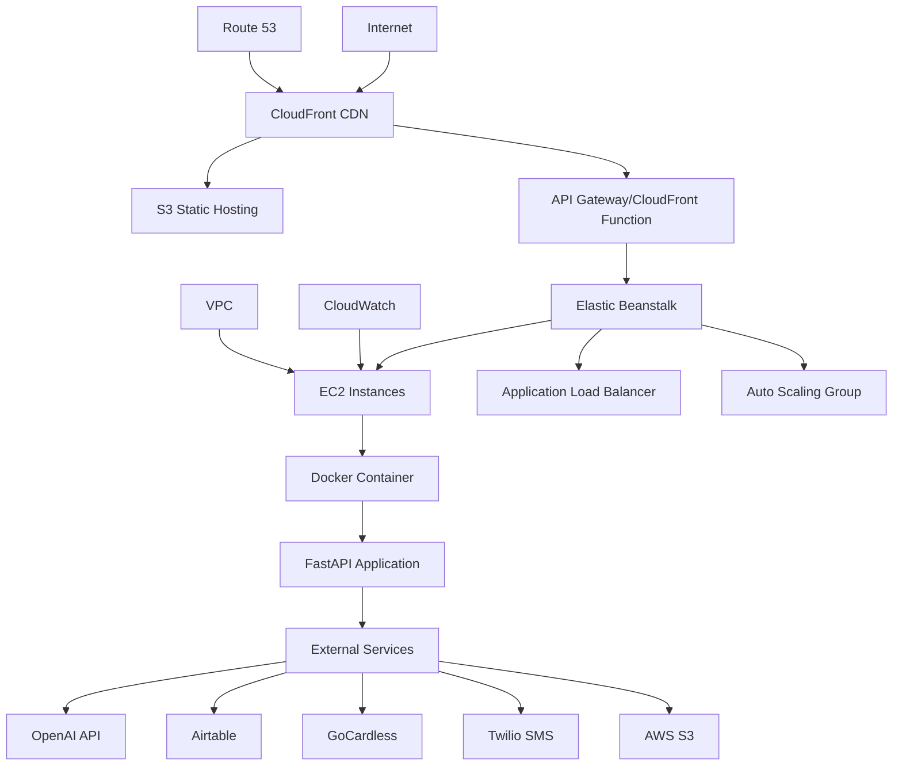

# Deployment Operations Low-Level Design (LLD)
## UTJFC Backend Infrastructure & Deployment Architecture

### Table of Contents
1. [Deployment Architecture Overview](#deployment-architecture-overview)
2. [AWS Elastic Beanstalk Infrastructure](#aws-elastic-beanstalk-infrastructure)
3. [Docker Configuration](#docker-configuration)
4. [CloudFront CDN Integration](#cloudfront-cdn-integration)
5. [Environment Configuration Management](#environment-configuration-management)
6. [Deployment Pipeline](#deployment-pipeline)
7. [Monitoring & Health Checks](#monitoring--health-checks)
8. [Scaling & Performance](#scaling--performance)
9. [Security Configuration](#security-configuration)
10. [Backup & Disaster Recovery](#backup--disaster-recovery)
11. [Maintenance & Operations](#maintenance--operations)
12. [Troubleshooting Guide](#troubleshooting-guide)

---

## Deployment Architecture Overview

### Infrastructure Components



### Deployment Characteristics
- **Platform**: AWS Elastic Beanstalk with Docker
- **Container Runtime**: Docker containers on Amazon Linux 2
- **Load Balancing**: Application Load Balancer with health checks
- **CDN**: CloudFront for static content and API routing
- **Auto Scaling**: Horizontal scaling based on CPU and memory metrics
- **Health Monitoring**: CloudWatch with Elastic Beanstalk health dashboard

---

## AWS Elastic Beanstalk Infrastructure

### Environment Configuration

#### Environment Details
- **Platform**: Docker running on 64bit Amazon Linux 2
- **Environment Type**: Load Balanced, Auto Scaling
- **Instance Type**: t3.medium (production), t3.small (development)
- **Deployment Type**: Rolling deployment with health checks

#### Current Deployment Structure
```
Production Environment: utjfc-backend-prod-3
├── Region: eu-north-1 (Stockholm)
├── Domain: utjfc-backend-prod-3.eba-3bpsyeak.eu-north-1.elasticbeanstalk.com
├── Load Balancer: Classic Load Balancer
├── Auto Scaling: 1-3 instances
└── Health Monitoring: Enhanced monitoring enabled
```

### Elastic Beanstalk Configuration Files

#### Application Structure
```
backend/
├── Dockerfile                 # Container configuration
├── requirements.txt          # Python dependencies
├── server.py                # Application entry point
├── .ebextensions/           # EB configuration (if needed)
└── .dockerignore           # Docker build exclusions
```

### Instance Configuration

#### EC2 Instance Details (`var/log/eb-engine.log`)
- **Instance Type**: Auto-determined by Elastic Beanstalk
- **Operating System**: Amazon Linux 2
- **Docker Runtime**: Latest stable Docker version
- **Health Agent**: healthd daemon for enhanced monitoring
- **Process Management**: systemd for service management

#### Bootstrap Process
```
1. Instance Launch → SyncClock
2. Configure OS → Skip (pre-configured AMI)
3. Install Dependencies → Docker, healthd, monitoring agents
4. Application Deployment → Docker container build and run
5. Health Check Setup → Load balancer registration
```

---

## Docker Configuration

### Dockerfile Analysis (`Dockerfile`)

#### Base Image Configuration
```dockerfile
FROM python:3.11-slim
```

#### System Dependencies
```dockerfile
# Install system dependencies for image processing and security
RUN apt-get update \
    && apt-get install -y --no-install-recommends \
        build-essential \
        libheif-dev \      # HEIC image processing
        libde265-dev \     # HEIC codec support
        libx265-dev \      # Video codec for image processing
        pkg-config \       # Package configuration
        curl \             # Health checks
    && apt-get clean \
    && rm -rf /var/lib/apt/lists/*
```

#### Application Configuration
```dockerfile
# Set working directory
WORKDIR /app

# Environment variables
ENV PYTHONDONTWRITEBYTECODE=1
ENV PYTHONUNBUFFERED=1
ENV PORT=80

# Copy and install dependencies
COPY requirements.txt .
RUN pip install --no-cache-dir --upgrade pip \
    && pip install --no-cache-dir -r requirements.txt

# Copy application code
COPY . .

# Create necessary directories
RUN mkdir -p /tmp/uploads

# Expose port
EXPOSE 80
```

#### Health Check Implementation
```dockerfile
HEALTHCHECK --interval=30s --timeout=30s --start-period=5s --retries=3 \
    CMD curl -f http://localhost:80/health || exit 1
```

#### Application Startup
```dockerfile
CMD ["uvicorn", "server:app", "--host", "0.0.0.0", "--port", "80", "--workers", "1"]
```

### Docker Build Optimizations
- **Layer Caching**: Requirements copied before application code
- **Minimal Base**: `python:3.11-slim` for smaller image size
- **Security**: Non-root user execution (handled by Elastic Beanstalk)
- **Health Monitoring**: Built-in health check endpoint

### Container Runtime Environment
- **Port Mapping**: Container port 80 → Load balancer port 80
- **Volume Mounts**: Temporary file storage in `/tmp/uploads`
- **Process Management**: Single worker process for AI consistency
- **Memory Limits**: Managed by Elastic Beanstalk based on instance type

---

## CloudFront CDN Integration

### Distribution Configuration (`cloudfront-config.json`)

#### Multi-Origin Setup
```json
{
  "Origins": {
    "Quantity": 2,
    "Items": [
      {
        "Id": "S3-utjfc-frontend-chat",
        "DomainName": "utjfc-frontend-chat.s3.eu-north-1.amazonaws.com"
      },
      {
        "Id": "API-utjfc-backend", 
        "DomainName": "utjfc-backend-prod-3.eba-3bpsyeak.eu-north-1.elasticbeanstalk.com"
      }
    ]
  }
}
```

#### Cache Behavior Configuration

##### Default Behavior (Frontend)
```json
{
  "DefaultCacheBehavior": {
    "TargetOriginId": "S3-utjfc-frontend-chat",
    "ViewerProtocolPolicy": "redirect-to-https",
    "AllowedMethods": ["HEAD", "GET"],
    "DefaultTTL": 86400,
    "MaxTTL": 31536000
  }
}
```

##### API Behavior (`/api/*`)
```json
{
  "PathPattern": "/api/*",
  "TargetOriginId": "API-utjfc-backend",
  "ViewerProtocolPolicy": "redirect-to-https",
  "AllowedMethods": ["HEAD", "DELETE", "POST", "GET", "OPTIONS", "PUT", "PATCH"],
  "ForwardedValues": {
    "QueryString": true,
    "Cookies": {"Forward": "all"},
    "Headers": [
      "Authorization", "Origin", "Accept", "Cache-Control",
      "Referer", "User-Agent", "Host", "Accept-Language",
      "Content-Length", "Content-Type"
    ]
  },
  "DefaultTTL": 0  // No caching for API requests
}
```

### CloudFront Functions

#### API Path Rewrite Function
```javascript
// arn:aws:cloudfront::650251723700:function/utjfc-api-path-rewrite
function handler(event) {
    var request = event.request;
    
    // Remove /api prefix from URI for backend routing
    if (request.uri.startsWith('/api/')) {
        request.uri = request.uri.substring(4);
    }
    
    return request;
}
```

### CloudFront Update Process (`update_cloudfront.py`)

#### Automated Domain Updates
```python
# Define the new domain name
new_domain = 'utjfc-backend-prod-3.eba-3bpsyeak.eu-north-1.elasticbeanstalk.com'

# Find and update the API origin domain
for origin in config['Origins']['Items']:
    if origin.get('Id') == 'API-utjfc-backend':
        origin['DomainName'] = new_domain
        break
```

#### Deployment Process
1. **Configuration Update**: Modify CloudFront configuration
2. **ETag Management**: Handle versioning with ETag values
3. **Distribution Update**: Apply changes through AWS CLI
4. **Propagation**: Wait for global edge location updates (5-15 minutes)

---

## Environment Configuration Management

### Production Environment (`env.production.template`)

#### Core Configuration
```bash
# Server Configuration
PORT=8000
HOST=0.0.0.0
ENVIRONMENT=production

# MCP Server Configuration (Production)
MCP_SERVER_URL=https://utjfc-mcp-server.replit.app/mcp
USE_MCP=true
```

#### Service Integration
```bash
# OpenAI API Configuration
OPENAI_API_KEY=your_openai_api_key_here

# Airtable Configuration
AIRTABLE_API_KEY=your_airtable_api_key_here
AIRTABLE_BASE_ID=appBLxf3qmGIBc6ue

# GoCardless Payment Configuration
GOCARDLESS_ACCESS_TOKEN=your_gocardless_access_token_here
GOCARDLESS_ENVIRONMENT=sandbox  # Change to 'live' for production

# AWS S3 Configuration
AWS_ACCESS_KEY_ID=your_aws_access_key_here
AWS_SECRET_ACCESS_KEY=your_aws_secret_key_here
AWS_REGION=eu-north-1
S3_BUCKET_NAME=utjfc-player-photos

# Twilio SMS Configuration
TWILIO_ACCOUNT_SID=your_twilio_account_sid_here
TWILIO_AUTH_TOKEN=your_twilio_auth_token_here
TWILIO_PHONE_NUMBER=your_twilio_phone_number_here
```

#### Security Configuration
```bash
# Session and Security Configuration
SESSION_SECRET_KEY=your_random_secret_key_here_for_sessions
CORS_ORIGINS=["https://urmstontownjfc.co.uk", "https://your-frontend-domain.com"]

# Logging Configuration
LOG_LEVEL=INFO
LOG_FORMAT=JSON
```

### Environment Detection (`upload_photo_to_s3_tool.py:29-35`)

#### Production Environment Detection
```python
is_production = (
    os.environ.get('AWS_EXECUTION_ENV') is not None or  # Lambda/ECS
    os.environ.get('AWS_CONTAINER_CREDENTIALS_RELATIVE_URI') is not None or  # ECS/Fargate
    os.environ.get('AWS_INSTANCE_ID') is not None or  # EC2
    os.path.exists('/opt/elasticbeanstalk') or  # Elastic Beanstalk
    os.environ.get('EB_IS_COMMAND_LEADER') is not None  # Elastic Beanstalk
)
```

#### Credential Management
```python
if not is_production and os.path.exists(os.path.expanduser('~/.aws/credentials')):
    # Local development - use AWS profile
    os.environ['AWS_PROFILE'] = 'footballclub'
else:
    # Production - use IAM role
    if 'AWS_PROFILE' in os.environ:
        del os.environ['AWS_PROFILE']
```

---

## Deployment Pipeline

### Manual Deployment Process

#### 1. Code Preparation
```bash
# Ensure all dependencies are updated
pip freeze > requirements.txt

# Verify Docker build locally
docker build -t utjfc-backend .
docker run -p 8000:80 utjfc-backend
```

#### 2. Environment Variables Setup
```bash
# Copy production template
cp env.production.template .env

# Update with actual production values
vim .env
```

#### 3. Elastic Beanstalk Deployment
```bash
# Initialize EB CLI (if not done)
eb init --platform docker --region eu-north-1

# Deploy to production environment
eb deploy utjfc-backend-prod-3

# Monitor deployment
eb health
eb logs
```

#### 4. CloudFront Configuration Update
```bash
# Update CloudFront domain reference
python update_cloudfront.py

# Apply CloudFront changes
aws cloudfront update-distribution \
    --id E2QSITLN2AAV5D \
    --distribution-config file://cloudfront-config-to-update.json \
    --if-match E2QSITLN2AAV5D
```

### Deployment Verification

#### Health Check Verification
```bash
# Check application health
curl -f https://utjfc-backend-prod-3.eba-3bpsyeak.eu-north-1.elasticbeanstalk.com/health

# Expected response:
{
  "status": "healthy",
  "message": "UTJFC Registration Backend is running"
}
```

#### Integration Testing
```bash
# Test key endpoints
curl -X POST https://d123abc456.cloudfront.net/api/chat \
  -H "Content-Type: application/json" \
  -d '{"user_message": "test", "session_id": "test"}'

# Test file upload
curl -X POST https://d123abc456.cloudfront.net/api/upload-async \
  -F "file=@test_photo.jpg" \
  -F "session_id=test"
```

---

## Monitoring & Health Checks

### Application Health Endpoint (`server.py:465-466`)

#### Health Check Implementation
```python
@app.get("/health")
async def health_check():
    return {"status": "healthy", "message": "UTJFC Registration Backend is running"}
```

### Elastic Beanstalk Health Monitoring

#### Health Dashboard Metrics
- **Application Health**: Overall application status
- **Instance Health**: Individual EC2 instance status
- **Load Balancer Health**: Target health and response times
- **Auto Scaling Events**: Scaling activities and triggers

#### Log File Monitoring (`var/log/`)
```
/var/log/
├── eb-engine.log          # Elastic Beanstalk deployment logs
├── eb-docker/             # Docker container logs
├── healthd/               # Health daemon logs
├── nginx/                 # Load balancer logs
└── cloud-init.log         # Instance initialization logs
```

### Simple Production Monitoring

#### Manual Health Checks (Recommended for Football Club)

##### Quick Status Check
```bash
# 1. Check application health via CloudFront
curl -f https://d1ahgtos8kkd8y.cloudfront.net/api/health

# Expected response:
# {"status":"healthy","message":"UTJFC Registration Backend is running"}

# 2. Check environment status
aws --profile footballclub elasticbeanstalk describe-environments \
  --environment-names "utjfc-backend-prod-3" \
  --query 'Environments[0].[EnvironmentName,Status,Health]' \
  --output table --no-cli-pager

# Expected: Ready | Green
```

##### During Registration Periods (July-September)
```bash
# Check recent events for any issues
aws --profile footballclub elasticbeanstalk describe-events \
  --environment-name "utjfc-backend-prod-3" \
  --start-time $(date -u -d '1 hour ago' +%Y-%m-%dT%H:%M:%SZ) \
  --max-records 10 --no-cli-pager

# Monitor application logs if needed
aws --profile footballclub logs describe-log-groups \
  --log-group-name-prefix "/aws/elasticbeanstalk/utjfc-backend-prod-3" \
  --no-cli-pager
```

#### AWS Console Monitoring (No Cost)

##### Elastic Beanstalk Dashboard
1. **AWS Console** → **Elastic Beanstalk** → **utjfc-backend-prod-3**
2. **Health tab** - Shows overall environment health
3. **Monitoring tab** - Basic CPU, memory, network metrics (free)
4. **Events tab** - Deployment and error events

##### Key Metrics to Watch
- **Environment Health**: Should be "Green" 
- **CPU Utilization**: Normal <50%, concerning >80%
- **Memory Utilization**: Normal <70%, concerning >85%
- **HTTP 4xx/5xx Errors**: Should be minimal during registration
- **Response Time**: Should be <2 seconds for normal requests

#### Simple Troubleshooting

##### If Health Check Fails
```bash
# 1. Check direct backend health (bypass CloudFront)
curl -f https://utjfc-backend-prod-3.eba-3bpsyeak.eu-north-1.elasticbeanstalk.com/health

# 2. Check recent deployment events
aws --profile footballclub elasticbeanstalk describe-events \
  --environment-name "utjfc-backend-prod-3" \
  --max-records 20 --no-cli-pager

# 3. Restart environment if needed (last resort)
aws --profile footballclub elasticbeanstalk restart-app-server \
  --environment-name "utjfc-backend-prod-3" --no-cli-pager
```

##### If Registration Issues Reported
```bash
# 1. Test core functionality
curl -X POST https://d1ahgtos8kkd8y.cloudfront.net/api/chat \
  -H "Content-Type: application/json" \
  -d '{"user_message":"test","session_id":"health_check"}'

# 2. Test photo upload endpoint
curl -X POST https://d1ahgtos8kkd8y.cloudfront.net/api/upload-async \
  -F "file=@test_photo.jpg" -F "session_id=health_check"

# 3. Check if it's a frontend issue
curl -I https://urmstontownjfc.co.uk/chat/
```

#### Monitoring During Peak Registration (July-September)

##### Daily Check Routine (2 minutes)
```bash
# Morning check during registration season
echo "=== UTJFC Backend Health Check ==="
curl -s https://d1ahgtos8kkd8y.cloudfront.net/api/health | jq '.'
aws --profile footballclub elasticbeanstalk describe-environments \
  --environment-names "utjfc-backend-prod-3" \
  --query 'Environments[0].[Status,Health,DateUpdated]' \
  --output table --no-cli-pager
echo "=== Check Complete ==="
```

##### Weekly Review (During Registration Period)
1. **Check environment health trends** in AWS Console
2. **Review any error events** from past week
3. **Verify backup/deployment procedures** work
4. **Test registration flow** end-to-end

#### When NOT to Set Up Complex Monitoring
- **Low traffic periods** (October-June) - system mostly idle
- **Small user base** - manageable to handle issues manually
- **Short registration windows** - easier to monitor manually during active periods
- **Single environment** - complexity not justified

#### CloudWatch Free Tier (No Additional Cost)
AWS provides these metrics for free with Elastic Beanstalk:
- **CPU Utilization**
- **Memory Utilization** 
- **Network In/Out**
- **Disk Read/Write**
- **HTTP Error Rates**
- **Response Times**

Access via: **AWS Console** → **CloudWatch** → **Metrics** → **AWS/ElasticBeanstalk**

---

## Scaling & Performance

### Auto Scaling Configuration

#### Scaling Triggers
```json
{
  "AutoScalingGroup": {
    "MinSize": 1,
    "MaxSize": 3,
    "DesiredCapacity": 1,
    "ScaleUpPolicy": {
      "MetricName": "CPUUtilization",
      "Threshold": 70,
      "ScalingAdjustment": 1
    },
    "ScaleDownPolicy": {
      "MetricName": "CPUUtilization", 
      "Threshold": 30,
      "ScalingAdjustment": -1
    }
  }
}
```

#### Performance Characteristics
- **Cold Start Time**: ~30 seconds for new instance deployment
- **Warm Instance Response**: <200ms for simple endpoints
- **AI Processing Time**: 30-60 seconds for registration processing
- **Photo Upload Processing**: 45-90 seconds including S3 upload

### Load Balancer Configuration

#### Health Check Settings
```json
{
  "HealthCheck": {
    "Target": "HTTP:80/health",
    "Interval": 30,
    "Timeout": 5,
    "HealthyThreshold": 3,
    "UnhealthyThreshold": 5
  }
}
```

#### Session Management
- **Session Affinity**: Disabled (stateless application)
- **Connection Draining**: 300 seconds
- **Cross-Zone Load Balancing**: Enabled

---

## Security Configuration

### Network Security

#### VPC Configuration
- **Private Subnets**: Application instances in private subnets
- **Public Subnets**: Load balancer in public subnets
- **Security Groups**: Restrictive inbound rules
- **NACLs**: Additional network-level security

#### Security Group Rules
```json
{
  "SecurityGroupRules": [
    {
      "Type": "Ingress",
      "Protocol": "HTTP",
      "Port": 80,
      "Source": "LoadBalancer"
    },
    {
      "Type": "Egress", 
      "Protocol": "HTTPS",
      "Port": 443,
      "Destination": "0.0.0.0/0"
    }
  ]
}
```

### Application Security

#### Environment Variable Protection
- **AWS Systems Manager**: Secure parameter storage
- **IAM Roles**: EC2 instance roles for AWS service access
- **Encryption**: Environment variables encrypted at rest

#### API Security
- **CORS Configuration**: Restricted origins
- **Rate Limiting**: CloudFront level rate limiting
- **Input Validation**: Pydantic model validation
- **File Upload Security**: Content type and size validation

### SSL/TLS Configuration

#### CloudFront SSL
- **SSL Certificate**: CloudFront default certificate
- **Minimum Protocol**: TLSv1.2
- **Cipher Suites**: Strong encryption algorithms
- **HSTS**: HTTP Strict Transport Security enabled

---

## Backup & Disaster Recovery

### Application Code Backup

#### Source Control
- **Primary Repository**: Git repository with complete history
- **Backup Repositories**: Multiple remote repositories
- **Version Tagging**: Production releases tagged with versions

#### Container Image Backup
- **Docker Registry**: AWS ECR for container image storage
- **Image Versioning**: Tagged images for rollback capability
- **Multi-Region Backup**: Images replicated across regions

### Configuration Backup

#### Elastic Beanstalk Configuration
```bash
# Save current configuration
eb config save production-config

# Backup configuration files
aws s3 cp .elasticbeanstalk/ s3://utjfc-config-backup/ --recursive
```

#### CloudFront Configuration
```bash
# Export current distribution configuration
aws cloudfront get-distribution-config \
    --id E2QSITLN2AAV5D > cloudfront-backup.json
```

### Data Recovery Procedures

#### Database Recovery
- **Airtable**: Data replicated in Airtable's cloud infrastructure
- **Session Data**: In-memory sessions (not persistent)
- **Uploaded Photos**: S3 with versioning and cross-region replication

#### Recovery Time Objectives (RTO)
- **Application Recovery**: 5-10 minutes (new deployment)
- **DNS Propagation**: 5-15 minutes (CloudFront updates)  
- **Full Service Recovery**: 15-25 minutes

#### Recovery Point Objectives (RPO)
- **Code Changes**: 0 seconds (Git commits)
- **Configuration Changes**: < 1 hour (manual backups)
- **User Data**: Real-time (external services)

---

## Maintenance & Operations

### Routine Maintenance Tasks

#### Weekly Tasks
```bash
# Check application health
eb health

# Review application logs
eb logs --all

# Monitor resource utilization
aws cloudwatch get-metric-statistics \
    --namespace AWS/ElasticBeanstalk \
    --metric-name CPUUtilization \
    --start-time 2025-01-01T00:00:00Z \
    --end-time 2025-01-07T23:59:59Z \
    --period 3600 \
    --statistics Average
```

#### Monthly Tasks
```bash
# Update dependencies
pip list --outdated
pip install --upgrade package_name

# Security updates
docker pull python:3.11-slim
docker build -t utjfc-backend:latest .

# Performance review
aws cloudwatch get-dashboard --dashboard-name UTJFC-Performance
```

### Configuration Updates

#### Environment Variable Updates
```bash
# Update environment variables
eb setenv OPENAI_API_KEY=new_key_value

# Verify update
eb printenv
```

#### Application Updates
```bash
# Deploy new version
eb deploy

# Monitor deployment
eb health --refresh

# Rollback if needed
eb deploy --version-label previous-version
```

### Capacity Planning

#### Traffic Patterns
- **Peak Hours**: 6 PM - 10 PM UK time
- **Peak Season**: July - September (registration period)
- **Expected Load**: 50-100 concurrent registrations during peak

#### Resource Scaling Recommendations
```json
{
  "PeakSeason": {
    "MinInstances": 2,
    "MaxInstances": 5,
    "InstanceType": "t3.large"
  },
  "OffSeason": {
    "MinInstances": 1, 
    "MaxInstances": 2,
    "InstanceType": "t3.medium"
  }
}
```

---

## Troubleshooting Guide

### Common Deployment Issues

#### 1. Container Build Failures
**Symptoms**: Deployment fails during Docker build
```bash
# Check Dockerfile syntax
docker build -t test-build .

# Review build logs
eb logs
```

**Solutions**:
- Verify all files are included (check `.dockerignore`)
- Ensure requirements.txt is up to date
- Check system dependencies installation

#### 2. Environment Variable Issues
**Symptoms**: Application fails to connect to external services
```bash
# Check environment variables
eb printenv

# Validate configuration
eb health
```

**Solutions**:
- Verify all required environment variables are set
- Check for typos in variable names
- Validate external service credentials

#### 3. Health Check Failures
**Symptoms**: Instances marked as unhealthy
```bash
# Check health endpoint directly
curl http://instance-ip/health

# Review health check logs
eb logs --all
```

**Solutions**:
- Verify health endpoint returns 200 status
- Check application startup time
- Review security group settings

### Performance Issues

#### 1. High Response Times
**Diagnostic Steps**:
```bash
# Check CloudWatch metrics
aws cloudwatch get-metric-statistics \
    --namespace AWS/ApplicationELB \
    --metric-name TargetResponseTime

# Review application logs
eb logs
```

**Solutions**:
- Scale up instance types
- Increase number of instances
- Optimize AI processing timeouts

#### 2. Memory Issues
**Diagnostic Steps**:
```bash
# Check memory usage
aws cloudwatch get-metric-statistics \
    --namespace AWS/EC2 \
    --metric-name MemoryUtilization
```

**Solutions**:
- Increase instance memory (larger instance type)
- Optimize photo processing pipeline
- Implement memory cleanup in AI processing

### External Service Issues

#### 1. OpenAI API Failures
**Symptoms**: AI processing timeouts or errors
```python
# Check retry mechanism logs
print(f"--- Session [{session_id}] AI call attempt {attempt + 1}/{max_retries + 1} ---")
```

**Solutions**:
- Verify API key validity
- Check rate limiting status
- Implement exponential backoff

#### 2. S3 Upload Failures
**Symptoms**: Photo upload failures
```python
# Check AWS credentials
boto3.client('s3', region_name=AWS_REGION)
```

**Solutions**:
- Verify IAM role permissions
- Check S3 bucket accessibility
- Validate file format support

### Monitoring Commands

#### Real-time Monitoring
```bash
# Watch application health
watch -n 30 'eb health'

# Monitor logs in real-time
eb logs --all --follow

# Check CloudFront status
aws cloudfront get-distribution --id E2QSITLN2AAV5D
```

#### Performance Analysis
```bash
# Get deployment history
eb history

# Analyze error patterns
eb logs | grep ERROR

# Check scaling events
aws autoscaling describe-scaling-activities
```

---

## Conclusion

The UTJFC backend deployment infrastructure provides a robust, scalable, and maintainable platform for the registration system. The combination of AWS Elastic Beanstalk, Docker containerization, and CloudFront CDN ensures high availability and performance while maintaining operational simplicity.

The deployment architecture supports:
- **High Availability**: Multi-AZ deployment with auto-scaling
- **Performance**: CDN acceleration and optimized container runtime
- **Security**: Multiple layers of security controls and monitoring
- **Maintainability**: Clear deployment procedures and comprehensive monitoring
- **Disaster Recovery**: Automated backups and rapid recovery procedures

The modular design allows for easy scaling during peak registration periods while maintaining cost efficiency during off-peak times. The comprehensive monitoring and alerting systems ensure rapid identification and resolution of any issues that may arise in production.