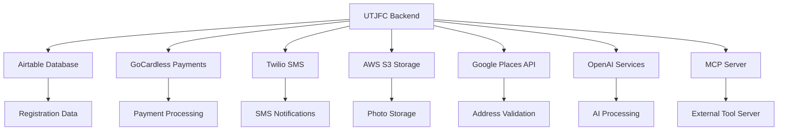

# External Integrations Low-Level Design (LLD)
## UTJFC Backend Service Integration Architecture

### Table of Contents
1. [Integration Overview](#integration-overview)
2. [Airtable Database Integration](#airtable-database-integration)
3. [GoCardless Payment Processing](#gocardless-payment-processing)
4. [Twilio SMS Services](#twilio-sms-services)
5. [AWS S3 Storage Integration](#aws-s3-storage-integration)
6. [Google Places API](#google-places-api)
7. [OpenAI Services](#openai-services)
8. [MCP Server Integration](#mcp-server-integration)
9. [Environment Configuration](#environment-configuration)
10. [Error Handling Strategies](#error-handling-strategies)
11. [Security Implementation](#security-implementation)
12. [Monitoring & Health Checks](#monitoring--health-checks)
13. [Performance Optimization](#performance-optimization)

---

## Integration Overview

### Service Architecture Map
The UTJFC backend integrates with 7 major external services to provide comprehensive registration functionality:



### Integration Characteristics

| Service | Primary Use | Authentication | Criticality | Fallback Strategy |
|---------|-------------|----------------|-------------|------------------|
| **Airtable** | Registration database | Personal Access Token | Critical | None (hard dependency) |
| **GoCardless** | Payment processing | API Token | Critical | Manual payment processing |
| **Twilio** | SMS notifications | SID + Auth Token | High | Email notifications |
| **AWS S3** | Photo storage | Access Key + Secret | Medium | Local storage |
| **Google Places** | Address validation | API Key | Medium | Manual address entry |
| **OpenAI** | AI processing | API Key | Critical | Simplified responses |
| **MCP Server** | External tools | Optional Token | Low | Local tool execution |

---

## Airtable Database Integration

### Service Configuration
```python
# Location: registration_agent/tools/airtable/airtable_tool_definition.py

class AirtableIntegration:
    """
    Comprehensive Airtable integration for registration data management.
    """
    
    def __init__(self):
        self.api_key = os.getenv('AIRTABLE_PAT')  # Personal Access Token
        self.base_id = 'appBLxf3qmGIBc6ue'       # Football Club Base
        self.api = Api(self.api_key)
        
    def get_table(self, table_name: str):
        """Get table instance with error handling."""
        try:
            return self.api.table(self.base_id, table_name)
        except Exception as e:
            raise AirtableError(f"Failed to access table {table_name}: {str(e)}")
```

### Database Schema Integration

#### Primary Tables
```python
# Season-specific table structure
REGISTRATION_TABLE = "registrations_2526"  # Current season
TEAM_INFO_TABLE = "team_info"              # Team configurations
SUSPENDED_TABLE = "suspended_registrations" # Payment failures

# Registration record schema
registration_schema = {
    # Parent Information
    "parent_full_name": str,        # AI-validated names
    "parent_phone": str,            # UK mobile format
    "parent_email": str,            # Validated email format
    "parent_dob": str,              # DD-MM-YYYY format
    "parent_address": str,          # Google Places validated
    "parent_relationship": str,     # Mother/Father/Guardian/Other
    
    # Child Information
    "child_full_name": str,         # AI-validated names
    "child_dob": str,               # DD-MM-YYYY with age validation
    "child_gender": str,            # Male/Female/Not disclosed
    "medical_issues": str,          # Comma-separated conditions
    "child_address": str,           # If different from parent
    
    # Registration Metadata
    "team": str,                    # From registration code
    "age_group": str,               # Calculated from DOB
    "season": str,                  # From registration code
    "registration_status": str,     # active/incomplete/suspended
    "created_date": datetime,       # Auto-generated
    "conversation_history": str,    # JSON conversation log
    
    # Payment Information  
    "billing_request_id": str,      # GoCardless identifier
    "payment_token": str,           # Payment link token
    "signing_on_fee_paid": str,     # Y/N status
    "mandate_authorised": str,      # Y/N status
    "subscription_activated": str,  # Y/N status
    "monthly_subscription_amount": float, # With sibling discounts
    "preferred_payment_day": int,   # 1-28 or -1 for last day
    
    # Kit Information
    "kit_size": str,                # 5/6 to 3XL
    "shirt_number": int,            # 1-25 with conflict checking
    "kit_type": str,                # goalkeeper/outfield
    
    # Photo Information
    "photo_s3_url": str,            # AWS S3 public URL
    "photo_filename": str,          # Original filename
    
    # SMS Tracking
    "sms_delivery_status": str,     # sent/delivered/failed
    "sms_sent_timestamp": datetime, # Delivery tracking
}
```

### CRUD Operations

#### Create Registration
```python
def create_registration(registration_data: dict) -> dict:
    """
    Create new registration with comprehensive validation.
    """
    try:
        # 1. Validate using Pydantic model
        validated_data = RegistrationDataContract(**registration_data)
        
        # 2. Check for duplicate registrations
        existing = check_existing_registration(
            validated_data.parent_email,
            validated_data.child_full_name,
            validated_data.season
        )
        
        if existing:
            return {
                "success": False,
                "error": "Registration already exists",
                "existing_id": existing["id"]
            }
        
        # 3. Create Airtable record
        table = self.get_table(REGISTRATION_TABLE)
        record = table.create(validated_data.dict(exclude_none=True))
        
        return {
            "success": True,
            "record_id": record["id"],
            "fields": record["fields"]
        }
        
    except ValidationError as e:
        return {
            "success": False,
            "error": f"Validation failed: {str(e)}"
        }
    except Exception as e:
        return {
            "success": False,
            "error": f"Database creation failed: {str(e)}"
        }
```

#### Query Operations
```python
def query_registrations(criteria: dict) -> list:
    """
    Query registrations with advanced filtering.
    """
    try:
        table = self.get_table(REGISTRATION_TABLE)
        
        # Build Airtable formula
        conditions = []
        for field, value in criteria.items():
            if isinstance(value, str):
                conditions.append(f"{{{field}}} = '{value}'")
            else:
                conditions.append(f"{{{field}}} = {value}")
        
        formula = f"AND({', '.join(conditions)})" if len(conditions) > 1 else conditions[0]
        
        # Execute query
        records = table.all(formula=formula)
        
        return {
            "success": True,
            "records": records,
            "count": len(records)
        }
        
    except Exception as e:
        return {
            "success": False,
            "error": f"Query failed: {str(e)}"
        }
```

### Sibling Detection Logic
```python
def find_existing_siblings(parent_name: str, child_surname: str, exclude_id: str = None) -> list:
    """
    Detect existing siblings for discount application.
    """
    try:
        # Extract child surname for matching
        child_surname = child_surname.split()[-1]  # Last word as surname
        
        # Build sibling detection formula
        conditions = [
            f"{{parent_full_name}} = '{parent_name}'",
            f"{{player_last_name}} = '{child_surname}'"
        ]
        
        if exclude_id:
            conditions.append(f"{{billing_request_id}} != '{exclude_id}'")
        
        formula = f"AND({', '.join(conditions)})"
        
        # Query for existing siblings
        table = self.get_table(REGISTRATION_TABLE)
        siblings = table.all(formula=formula)
        
        return {
            "siblings_found": len(siblings) > 0,
            "sibling_count": len(siblings),
            "eligible_for_discount": len(siblings) > 0,
            "siblings": siblings
        }
        
    except Exception as e:
        return {
            "siblings_found": False,
            "error": f"Sibling detection failed: {str(e)}"
        }
```

---

## GoCardless Payment Processing

### Service Configuration
```python
# Location: registration_agent/tools/registration_tools/gocardless_payment.py

class GoCardlessIntegration:
    """
    Complete GoCardless payment processing integration.
    """
    
    def __init__(self):
        self.client = gocardless_pro.Client(
            access_token=os.getenv('GOCARDLESS_TOKEN'),
            environment='live'  # Use 'sandbox' for testing
        )
        self.webhook_secret = os.getenv('GOCARDLESS_WEBHOOK_SECRET')
```

### Payment Flow Implementation

#### Billing Request Creation
```python
def create_billing_request(payment_data: dict) -> dict:
    """
    Create GoCardless billing request for registration payments.
    """
    try:
        # 1. Validate payment data
        preferred_day = payment_data.get('preferred_payment_day')
        if preferred_day not in range(-1, 29) or preferred_day == 0:
            return {
                "success": False,
                "error": "Invalid payment day. Must be 1-28 or -1 for last day"
            }
        
        # 2. Standard fee structure
        signing_fee_pence = 4500   # £45.00
        monthly_fee_pence = 2750   # £27.50
        
        # 3. Create billing request
        billing_request = self.client.billing_requests.create(
            params={
                "payment_request": {
                    "amount": signing_fee_pence,
                    "currency": "GBP",
                    "description": "UTJFC Annual Registration Fee"
                },
                "mandate_request": {
                    "currency": "GBP",
                    "verify": "recommended",
                    "scheme": "bacs",
                    "metadata": {
                        "preferred_payment_day": str(preferred_day),
                        "monthly_amount_pence": str(monthly_fee_pence)
                    }
                }
            }
        )
        
        # 4. Generate payment URL
        base_url = os.getenv('FRONTEND_URL', 'https://utjfc.replit.app')
        payment_url = f"{base_url}/reg_setup/{billing_request.id}"
        
        return {
            "success": True,
            "billing_request_id": billing_request.id,
            "payment_url": payment_url,
            "signing_fee_amount_pounds": 45.00,
            "monthly_amount_pounds": 27.50,
            "status": billing_request.status
        }
        
    except Exception as e:
        return {
            "success": False,
            "error": f"GoCardless billing request failed: {str(e)}"
        }
```

#### Subscription Management with Sibling Discounts
```python
def create_subscription_with_discount(mandate_id: str, registration_data: dict) -> dict:
    """
    Create monthly subscription with automatic sibling discount detection.
    """
    try:
        # 1. Extract key information
        parent_name = registration_data.get('parent_full_name', '')
        child_name = registration_data.get('child_full_name', '')
        billing_request_id = registration_data.get('billing_request_id', '')
        
        # 2. Base monthly amount
        monthly_amount_pence = 2750  # £27.50
        
        # 3. Check for existing siblings (sibling discount logic)
        if parent_name and child_name:
            child_surname = child_name.split()[-1]  # Extract surname
            
            # Query for existing siblings
            sibling_result = find_existing_siblings(
                parent_name, 
                child_surname, 
                exclude_id=billing_request_id
            )
            
            if sibling_result["siblings_found"]:
                # Apply 10% sibling discount
                original_amount = monthly_amount_pence
                monthly_amount_pence = int(monthly_amount_pence * 0.9)  # £24.75
                
                print(f"🎉 SIBLING DISCOUNT APPLIED: {sibling_result['sibling_count']} existing siblings")
                print(f"   Original: £{original_amount/100:.2f} → Discounted: £{monthly_amount_pence/100:.2f}")
                
                # Update database with discounted amount
                update_registration_discount(billing_request_id, monthly_amount_pence/100)
        
        # 4. Create subscription
        subscription = self.client.subscriptions.create(
            params={
                "amount": monthly_amount_pence,
                "currency": "GBP",
                "name": "UTJFC Monthly Subscription",
                "interval_unit": "monthly",
                "day_of_month": get_payment_day(registration_data),
                "start_date": calculate_subscription_start_date(),
                "end_date": "2025-05-31",  # End of season
                "links": {"mandate": mandate_id},
                "metadata": {
                    "player_name": child_name,
                    "team": registration_data.get('team', ''),
                    "season": "2024-25"
                }
            }
        )
        
        return {
            "success": True,
            "subscription_id": subscription.id,
            "amount_pence": monthly_amount_pence,
            "amount_pounds": monthly_amount_pence / 100,
            "sibling_discount_applied": monthly_amount_pence < 2750,
            "start_date": subscription.start_date
        }
        
    except Exception as e:
        return {
            "success": False,
            "error": f"Subscription creation failed: {str(e)}"
        }
```

### Webhook Processing
```python
def process_gocardless_webhook(webhook_data: dict, signature: str) -> dict:
    """
    Process GoCardless webhook events with signature verification.
    """
    try:
        # 1. Verify webhook signature
        if not verify_webhook_signature(webhook_data, signature):
            return {"success": False, "error": "Invalid webhook signature"}
        
        # 2. Process each event
        processed_events = []
        for event in webhook_data.get('events', []):
            result = process_webhook_event(event)
            processed_events.append(result)
        
        return {
            "success": True,
            "events_processed": len(processed_events),
            "results": processed_events
        }
        
    except Exception as e:
        return {
            "success": False,
            "error": f"Webhook processing failed: {str(e)}"
        }

def process_webhook_event(event: dict) -> dict:
    """
    Process individual webhook event types.
    """
    event_type = event['resource_type']
    action = event['action']
    resource_id = event['links']['billing_request']
    
    try:
        if event_type == 'billing_requests' and action == 'fulfilled':
            # Payment authorization completed
            return process_billing_request_fulfilled(resource_id)
            
        elif event_type == 'subscriptions' and action == 'created':
            # Monthly subscription activated
            return process_subscription_created(resource_id)
            
        elif event_type == 'payments' and action == 'confirmed':
            # Payment successfully collected
            return process_payment_confirmed(resource_id)
            
        elif event_type == 'mandates' and action == 'active':
            # Direct debit mandate activated
            return process_mandate_activated(resource_id)
            
        else:
            return {
                "success": True,
                "action": "ignored",
                "event_type": event_type,
                "action_type": action
            }
            
    except Exception as e:
        return {
            "success": False,
            "error": f"Event processing failed: {str(e)}",
            "event_type": event_type
        }
```

---

## Twilio SMS Services

### Service Configuration
```python
# Location: registration_agent/tools/registration_tools/send_sms_payment_link.py

class TwilioIntegration:
    """
    SMS notification system for payment links and confirmations.
    """
    
    def __init__(self):
        self.account_sid = os.getenv('TWILIO_ACCOUNT_SID')
        self.auth_token = os.getenv('TWILIO_AUTH_TOKEN')
        self.from_number = os.getenv('TWILIO_FROM_NUMBER', '+447480618302')
        self.client = Client(self.account_sid, self.auth_token)
```

### SMS Delivery System

#### Payment Link SMS
```python
def send_payment_link_sms(phone_number: str, payment_data: dict) -> dict:
    """
    Send payment link SMS with comprehensive error handling.
    """
    try:
        # 1. Validate UK mobile number
        cleaned_phone = clean_uk_phone_number(phone_number)
        if not is_valid_uk_mobile(cleaned_phone):
            return {
                "success": False,
                "error": "Invalid UK mobile number format"
            }
        
        # 2. Generate payment link with CloudFront
        base_url = os.getenv('CLOUDFRONT_URL', 'https://d3lws4g2kw8iyh.cloudfront.net')
        payment_link = f"{base_url}/reg_setup/{payment_data['billing_request_id']}"
        
        # 3. Construct SMS message
        child_name = payment_data.get('child_name', 'your child')
        message_body = f"""UTJFC Registration Payment

Hi! Please complete {child_name}'s registration payment:

{payment_link}

Payment includes:
• £45 signing fee
• £27.50/month Direct Debit (Sep-May)

Complete within 7 days to secure the place.

Questions? Email admin@urmstontownjfc.co.uk"""
        
        # 4. Send SMS via Twilio
        message = self.client.messages.create(
            body=message_body,
            from_=self.from_number,
            to=cleaned_phone
        )
        
        # 5. Log delivery metrics
        log_sms_delivery({
            "phone_number": cleaned_phone,
            "message_sid": message.sid,
            "status": message.status,
            "payment_link": payment_link,
            "timestamp": datetime.now().isoformat()
        })
        
        return {
            "success": True,
            "message_sid": message.sid,
            "status": message.status,
            "to": cleaned_phone,
            "payment_link": payment_link
        }
        
    except Exception as e:
        return {
            "success": False,
            "error": f"SMS delivery failed: {str(e)}"
        }

def clean_uk_phone_number(phone: str) -> str:
    """
    Clean and format UK mobile number.
    """
    # Remove all non-digit characters
    digits_only = re.sub(r'[^\d]', '', phone)
    
    # Handle different UK mobile formats
    if digits_only.startswith('447'):
        # International format: +447...
        return f"+{digits_only}"
    elif digits_only.startswith('07'):
        # National format: 07...
        return f"+44{digits_only[1:]}"
    else:
        return phone  # Return as-is for validation to catch
```

#### SMS Status Tracking
```python
def track_sms_delivery_status(message_sid: str) -> dict:
    """
    Track SMS delivery status and update database.
    """
    try:
        # 1. Fetch message status from Twilio
        message = self.client.messages(message_sid).fetch()
        
        # 2. Map Twilio status to our system
        status_mapping = {
            'queued': 'pending',
            'sending': 'pending', 
            'sent': 'sent',
            'delivered': 'delivered',
            'failed': 'failed',
            'undelivered': 'failed'
        }
        
        our_status = status_mapping.get(message.status, 'unknown')
        
        # 3. Update database record
        update_sms_status_in_db(message_sid, our_status, message.error_code)
        
        return {
            "success": True,
            "message_sid": message_sid,
            "status": our_status,
            "twilio_status": message.status,
            "error_code": message.error_code
        }
        
    except Exception as e:
        return {
            "success": False,
            "error": f"Status tracking failed: {str(e)}"
        }
```

---

## AWS S3 Storage Integration

### Service Configuration
```python
# Location: registration_agent/tools/registration_tools/upload_photo_to_s3_tool.py

class S3Integration:
    """
    AWS S3 integration for player photo storage.
    """
    
    def __init__(self):
        self.s3_client = boto3.client(
            's3',
            aws_access_key_id=os.getenv('AWS_ACCESS_KEY_ID'),
            aws_secret_access_key=os.getenv('AWS_SECRET_ACCESS_KEY'),
            region_name=os.getenv('AWS_REGION', 'eu-west-2')
        )
        self.bucket_name = os.getenv('AWS_S3_BUCKET_NAME')
```

### Photo Upload Pipeline

#### HEIC Conversion Support
```python
def upload_photo_with_conversion(file_path: str, metadata: dict) -> dict:
    """
    Upload photo with automatic HEIC to JPEG conversion.
    """
    try:
        # 1. Validate file existence and format
        if not os.path.exists(file_path):
            return {"success": False, "error": "File not found"}
        
        # 2. Check file format
        file_ext = os.path.splitext(file_path)[1].lower()
        allowed_formats = ['.jpg', '.jpeg', '.png', '.heic', '.webp']
        
        if file_ext not in allowed_formats:
            return {
                "success": False,
                "error": f"Unsupported format: {file_ext}"
            }
        
        # 3. HEIC conversion if needed
        upload_path = file_path
        if file_ext == '.heic':
            upload_path = convert_heic_to_jpeg(file_path)
            if not upload_path:
                return {
                    "success": False,
                    "error": "HEIC conversion failed"
                }
        
        # 4. Generate S3 key with structured naming
        s3_key = generate_s3_key(metadata, upload_path)
        
        # 5. Upload to S3 with metadata
        upload_result = upload_to_s3_with_metadata(upload_path, s3_key, metadata)
        
        # 6. Cleanup temporary files
        if upload_path != file_path:  # Converted file
            os.remove(upload_path)
        
        return upload_result
        
    except Exception as e:
        return {
            "success": False,
            "error": f"Photo upload failed: {str(e)}"
        }

def convert_heic_to_jpeg(heic_path: str) -> str:
    """
    Convert HEIC files to JPEG with iOS compatibility.
    """
    try:
        # Import HEIC support with fallback
        try:
            from pillow_heif import register_heif_opener
            register_heif_opener()
        except ImportError:
            print("HEIC support not available - ensure pillow-heif is installed")
            return None
        
        from PIL import Image
        
        # Open HEIC file
        with Image.open(heic_path) as image:
            # Convert color mode for JPEG compatibility
            if image.mode in ('RGBA', 'LA', 'P'):
                image = image.convert('RGB')
            
            # Generate output filename
            jpeg_path = heic_path.replace('.heic', '_converted.jpg')
            
            # Save as JPEG with high quality
            image.save(jpeg_path, 'JPEG', quality=90, optimize=True)
            
            return jpeg_path
            
    except Exception as e:
        print(f"HEIC conversion error: {str(e)}")
        return None
```

#### S3 Upload with Metadata
```python
def upload_to_s3_with_metadata(file_path: str, s3_key: str, metadata: dict) -> dict:
    """
    Upload file to S3 with comprehensive metadata.
    """
    try:
        # 1. Prepare metadata
        s3_metadata = {
            'player-name': metadata.get('player_name', ''),
            'team': metadata.get('team', ''),
            'age-group': metadata.get('age_group', ''),
            'upload-timestamp': datetime.now().isoformat(),
            'original-filename': os.path.basename(file_path)
        }
        
        # 2. Determine content type
        content_type = get_content_type(file_path)
        
        # 3. Upload to S3
        with open(file_path, 'rb') as file_data:
            self.s3_client.upload_fileobj(
                file_data,
                self.bucket_name,
                s3_key,
                ExtraArgs={
                    'ContentType': content_type,
                    'Metadata': s3_metadata,
                    'ACL': 'public-read'  # Make photos publicly accessible
                }
            )
        
        # 4. Generate public URL
        s3_url = f"https://{self.bucket_name}.s3.amazonaws.com/{s3_key}"
        
        # 5. Verify upload
        try:
            self.s3_client.head_object(Bucket=self.bucket_name, Key=s3_key)
        except ClientError:
            return {
                "success": False,
                "error": "Upload verification failed"
            }
        
        return {
            "success": True,
            "s3_url": s3_url,
            "s3_key": s3_key,
            "bucket": self.bucket_name,
            "size": os.path.getsize(file_path)
        }
        
    except Exception as e:
        return {
            "success": False,
            "error": f"S3 upload failed: {str(e)}"
        }

def generate_s3_key(metadata: dict, file_path: str) -> str:
    """
    Generate structured S3 key for organized storage.
    """
    # Extract components
    player_name = metadata.get('player_name', 'unknown')
    team = metadata.get('team', 'unknown')
    age_group = metadata.get('age_group', 'unknown')
    season = metadata.get('season', '2526')
    
    # Sanitize for S3 key format
    safe_player = re.sub(r'[^a-zA-Z0-9]', '_', player_name)
    safe_team = re.sub(r'[^a-zA-Z0-9]', '_', team)
    
    # Get file extension
    file_ext = os.path.splitext(file_path)[1].lower()
    
    # Generate structured key
    s3_key = f"player_photos/{season}/{safe_team}/{age_group}/{safe_player}{file_ext}"
    
    return s3_key
```

---

## Google Places API

### Service Configuration
```python
# Location: registration_agent/tools/registration_tools/address_lookup_tool.py

class GooglePlacesIntegration:
    """
    Google Places API integration for UK address validation.
    """
    
    def __init__(self):
        self.api_key = os.getenv('GOOGLE_PLACES_API_KEY')
        self.base_url = "https://maps.googleapis.com/maps/api/place"
```

### Address Lookup System

#### Postcode + House Number Lookup
```python
def lookup_uk_address(postcode: str, house_number: str) -> dict:
    """
    Lookup full UK address using postcode and house number.
    """
    try:
        # 1. Clean and validate postcode
        clean_postcode = clean_uk_postcode(postcode)
        if not is_valid_uk_postcode(clean_postcode):
            return {
                "success": False,
                "error": "Invalid UK postcode format"
            }
        
        # 2. Construct search query
        search_query = f"{house_number} {clean_postcode}, UK"
        
        # 3. Google Places Text Search
        search_result = places_text_search(search_query)
        if not search_result["success"]:
            return search_result
        
        # 4. Get place details for best match
        if search_result["candidates"]:
            place_id = search_result["candidates"][0]["place_id"]
            details_result = get_place_details(place_id)
            
            if details_result["success"]:
                return format_uk_address(details_result["place_details"])
        
        return {
            "success": False,
            "error": "No matching address found"
        }
        
    except Exception as e:
        return {
            "success": False,
            "error": f"Address lookup failed: {str(e)}"
        }

def places_text_search(query: str) -> dict:
    """
    Perform Google Places text search.
    """
    try:
        url = f"{self.base_url}/textsearch/json"
        params = {
            'query': query,
            'key': self.api_key,
            'region': 'uk',
            'type': 'street_address'
        }
        
        response = requests.get(url, params=params, timeout=10)
        response.raise_for_status()
        
        data = response.json()
        
        if data['status'] == 'OK':
            return {
                "success": True,
                "candidates": data.get('results', [])
            }
        else:
            return {
                "success": False,
                "error": f"Places API error: {data['status']}"
            }
            
    except requests.RequestException as e:
        return {
            "success": False,
            "error": f"Places API request failed: {str(e)}"
        }

def get_place_details(place_id: str) -> dict:
    """
    Get detailed place information from place ID.
    """
    try:
        url = f"{self.base_url}/details/json"
        params = {
            'place_id': place_id,
            'key': self.api_key,
            'fields': 'formatted_address,address_components,geometry'
        }
        
        response = requests.get(url, params=params, timeout=10)
        response.raise_for_status()
        
        data = response.json()
        
        if data['status'] == 'OK':
            return {
                "success": True,
                "place_details": data['result']
            }
        else:
            return {
                "success": False,
                "error": f"Place details error: {data['status']}"
            }
            
    except requests.RequestException as e:
        return {
            "success": False,
            "error": f"Place details request failed: {str(e)}"
        }
```

#### Address Formatting and Validation
```python
def format_uk_address(place_details: dict) -> dict:
    """
    Format Google Places result into UK address format.
    """
    try:
        # Extract address components
        components = place_details.get('address_components', [])
        
        address_parts = {
            'house_number': '',
            'street': '',
            'locality': '',
            'town': '',
            'county': '',
            'postcode': '',
            'country': ''
        }
        
        # Parse address components
        for component in components:
            types = component['types']
            long_name = component['long_name']
            
            if 'street_number' in types:
                address_parts['house_number'] = long_name
            elif 'route' in types:
                address_parts['street'] = long_name
            elif 'locality' in types or 'sublocality' in types:
                address_parts['locality'] = long_name
            elif 'postal_town' in types:
                address_parts['town'] = long_name
            elif 'administrative_area_level_2' in types:
                address_parts['county'] = long_name
            elif 'postal_code' in types:
                address_parts['postcode'] = long_name
            elif 'country' in types:
                address_parts['country'] = long_name
        
        # Validate UK address
        if address_parts['country'].lower() != 'united kingdom':
            return {
                "success": False,
                "error": "Address is not in the United Kingdom"
            }
        
        # Construct formatted address
        formatted_lines = []
        
        # Line 1: House number + Street
        if address_parts['house_number'] and address_parts['street']:
            formatted_lines.append(f"{address_parts['house_number']} {address_parts['street']}")
        
        # Line 2: Locality (if different from town)
        if address_parts['locality'] and address_parts['locality'] != address_parts['town']:
            formatted_lines.append(address_parts['locality'])
        
        # Line 3: Town
        if address_parts['town']:
            formatted_lines.append(address_parts['town'])
        
        # Line 4: County + Postcode
        county_postcode = []
        if address_parts['county']:
            county_postcode.append(address_parts['county'])
        if address_parts['postcode']:
            county_postcode.append(address_parts['postcode'])
        
        if county_postcode:
            formatted_lines.append(' '.join(county_postcode))
        
        formatted_address = ', '.join(formatted_lines)
        
        return {
            "success": True,
            "formatted_address": formatted_address,
            "components": address_parts,
            "confidence": calculate_address_confidence(address_parts)
        }
        
    except Exception as e:
        return {
            "success": False,
            "error": f"Address formatting failed: {str(e)}"
        }

def calculate_address_confidence(address_parts: dict) -> float:
    """
    Calculate confidence score for address completeness.
    """
    required_components = ['house_number', 'street', 'postcode']
    optional_components = ['locality', 'town', 'county']
    
    # Required components score (70% weight)
    required_score = sum(1 for comp in required_components if address_parts[comp]) / len(required_components)
    
    # Optional components score (30% weight)
    optional_score = sum(1 for comp in optional_components if address_parts[comp]) / len(optional_components)
    
    confidence = (required_score * 0.7) + (optional_score * 0.3)
    return round(confidence, 2)
```

---

## OpenAI Services

### Service Configuration
```python
# Location: registration_agent/responses_reg.py

class OpenAIIntegration:
    """
    OpenAI API integration with comprehensive error handling.
    """
    
    def __init__(self):
        self.client = OpenAI(api_key=os.getenv('OPENAI_API_KEY'))
        self.default_model = "gpt-4o-mini"
        self.max_retries = 3
        self.retry_delay = 1.0
```

### AI Call Processing with Retry Logic

#### Registration Chat Loop
```python
def chat_loop_new_registration_1(
    model: str,
    agent_instructions: str,
    conversation_history: list,
    tools: list
) -> dict:
    """
    Process registration conversation with OpenAI Responses API.
    """
    try:
        # 1. Prepare messages
        messages = [
            {"role": "system", "content": agent_instructions}
        ] + conversation_history
        
        # 2. Call OpenAI with tools
        response = self.client.beta.responses.create(
            model=model,
            messages=messages,
            tools=tools,
            response_format=RegistrationResponseSchema,
            max_tokens=4000,
            temperature=0.1
        )
        
        return {
            "success": True,
            "response": response,
            "usage": response.usage.dict() if hasattr(response, 'usage') else None
        }
        
    except Exception as e:
        return {
            "success": False,
            "error": f"OpenAI API call failed: {str(e)}"
        }
```

#### Response Parsing with Multiple Strategies
```python
def parse_openai_response(response: object) -> dict:
    """
    Parse OpenAI response with multiple fallback strategies.
    """
    try:
        # Strategy 1: Structured response parsing
        if hasattr(response, 'output') and response.output:
            content = response.output[0].content[0].text
            
            try:
                structured_data = json.loads(content)
                if isinstance(structured_data, dict) and 'agent_final_response' in structured_data:
                    return {
                        "success": True,
                        "message": structured_data['agent_final_response'],
                        "routine_number": structured_data.get('routine_number'),
                        "metadata": structured_data.get('metadata', {})
                    }
            except json.JSONDecodeError:
                pass
        
        # Strategy 2: Re-registration specific parsing
        if hasattr(response, 'output_text') and response.output_text:
            try:
                structured_data = json.loads(response.output_text)
                if isinstance(structured_data, dict) and 'agent_final_response' in structured_data:
                    return {
                        "success": True,
                        "message": structured_data['agent_final_response'],
                        "routine_number": None
                    }
            except json.JSONDecodeError:
                # Fallback to raw text
                return {
                    "success": True,
                    "message": response.output_text,
                    "routine_number": None
                }
        
        # Strategy 3: Raw text fallback
        if hasattr(response, 'output') and response.output:
            raw_text = response.output[0].content[0].text
            return {
                "success": True,
                "message": raw_text,
                "routine_number": None
            }
        
        # Strategy 4: Error response
        return {
            "success": False,
            "error": "Could not parse OpenAI response",
            "raw_response": str(response)
        }
        
    except Exception as e:
        return {
            "success": False,
            "error": f"Response parsing failed: {str(e)}"
        }
```

#### Exponential Backoff Retry System
```python
def retry_openai_call_with_backoff(
    call_function,
    *args,
    max_retries: int = 3,
    base_delay: float = 1.0,
    **kwargs
) -> dict:
    """
    Retry OpenAI calls with exponential backoff for reliability.
    """
    last_error = None
    
    for attempt in range(max_retries + 1):
        try:
            print(f"OpenAI API call attempt {attempt + 1}/{max_retries + 1}")
            
            # Make API call
            result = call_function(*args, **kwargs)
            
            if result.get("success", False):
                print(f"OpenAI call succeeded on attempt {attempt + 1}")
                return result
            else:
                last_error = result.get("error", "Unknown error")
                
        except Exception as e:
            last_error = str(e)
            print(f"OpenAI call failed on attempt {attempt + 1}: {last_error}")
        
        # Don't sleep after the last attempt
        if attempt < max_retries:
            delay = base_delay * (2 ** attempt)  # Exponential backoff
            print(f"Retrying in {delay} seconds...")
            time.sleep(delay)
    
    return {
        "success": False,
        "error": f"OpenAI call failed after {max_retries + 1} attempts. Last error: {last_error}"
    }
```

---

## MCP Server Integration

### Service Configuration
```python
# Location: urmston_town_agent/agents.py

class MCPIntegration:
    """
    Model Context Protocol server integration for external tool execution.
    """
    
    def __init__(self):
        self.mcp_server_url = os.getenv('MCP_SERVER_URL', 'http://localhost:8002/sse')
        self.auth_token = os.getenv('MCP_AUTH_TOKEN')  # Optional
        self.timeout = 30
```

### MCP Agent Creation
```python
@classmethod
def create_mcp_agent(
    cls, 
    name: str = "MCP Agent",
    instructions: str = "You are a helpful agent with access to UTJFC registration tools.",
    mcp_server_url: str = None
):
    """
    Factory method to create MCP-enabled agent.
    """
    if not mcp_server_url:
        mcp_server_url = os.getenv("MCP_SERVER_URL", "http://localhost:8002/sse")
    
    return cls(
        name=name,
        model="gpt-4.1",  # MCP requires gpt-4.1+
        instructions=instructions,
        tools=["airtable_database_operation"],
        use_mcp=True,
        mcp_server_url=mcp_server_url
    )
```

### MCP Tool Configuration
```python
def get_mcp_tools_config(self) -> list:
    """
    Get MCP server configuration for OpenAI tool integration.
    """
    config = {
        "type": "mcp",
        "server_label": "utjfc_registration",
        "server_url": self.mcp_server_url,
        "require_approval": "never",  # Trust internal server
        "allowed_tools": self.tools if self.tools else None
    }
    
    # Add authentication if configured
    if self.auth_token:
        config["headers"] = {
            "Authorization": f"Bearer {self.auth_token}"
        }
    
    return [config]
```

### MCP Server Health Monitoring
```python
def check_mcp_server_health(server_url: str) -> dict:
    """
    Check MCP server availability and response time.
    """
    try:
        # Health check endpoint
        health_url = server_url.replace('/sse', '/health')
        
        start_time = time.time()
        response = requests.get(health_url, timeout=5)
        response_time = time.time() - start_time
        
        if response.status_code == 200:
            return {
                "healthy": True,
                "response_time_ms": round(response_time * 1000, 2),
                "server_url": server_url,
                "status": response.json() if response.headers.get('content-type') == 'application/json' else "OK"
            }
        else:
            return {
                "healthy": False,
                "error": f"HTTP {response.status_code}",
                "server_url": server_url
            }
            
    except requests.RequestException as e:
        return {
            "healthy": False,
            "error": f"Connection failed: {str(e)}",
            "server_url": server_url
        }
```

---

## Environment Configuration

### Configuration Management
```python
# Location: backend/.env (development) / environment variables (production)

class EnvironmentConfig:
    """
    Centralized environment configuration management.
    """
    
    @staticmethod
    def get_config() -> dict:
        """
        Get all environment configuration with validation.
        """
        return {
            # OpenAI Configuration
            "openai": {
                "api_key": os.getenv('OPENAI_API_KEY'),
                "model": os.getenv('OPENAI_MODEL', 'gpt-4o-mini'),
                "max_tokens": int(os.getenv('OPENAI_MAX_TOKENS', '4000'))
            },
            
            # Airtable Configuration
            "airtable": {
                "api_key": os.getenv('AIRTABLE_PAT'),
                "base_id": os.getenv('AIRTABLE_BASE_ID', 'appBLxf3qmGIBc6ue'),
                "table_name": os.getenv('AIRTABLE_TABLE', 'registrations_2526')
            },
            
            # GoCardless Configuration
            "gocardless": {
                "token": os.getenv('GOCARDLESS_TOKEN'),
                "environment": os.getenv('GOCARDLESS_ENV', 'sandbox'),
                "webhook_secret": os.getenv('GOCARDLESS_WEBHOOK_SECRET')
            },
            
            # Twilio Configuration
            "twilio": {
                "account_sid": os.getenv('TWILIO_ACCOUNT_SID'),
                "auth_token": os.getenv('TWILIO_AUTH_TOKEN'),
                "from_number": os.getenv('TWILIO_FROM_NUMBER')
            },
            
            # AWS Configuration
            "aws": {
                "access_key_id": os.getenv('AWS_ACCESS_KEY_ID'),
                "secret_access_key": os.getenv('AWS_SECRET_ACCESS_KEY'),
                "s3_bucket": os.getenv('AWS_S3_BUCKET_NAME'),
                "region": os.getenv('AWS_REGION', 'eu-west-2')
            },
            
            # Google Places Configuration
            "google": {
                "places_api_key": os.getenv('GOOGLE_PLACES_API_KEY')
            },
            
            # MCP Configuration
            "mcp": {
                "server_url": os.getenv('MCP_SERVER_URL', 'http://localhost:8002/sse'),
                "auth_token": os.getenv('MCP_AUTH_TOKEN'),
                "use_mcp": os.getenv('USE_MCP', 'false').lower() == 'true'
            },
            
            # Application Configuration
            "app": {
                "frontend_url": os.getenv('FRONTEND_URL', 'https://utjfc.replit.app'),
                "cloudfront_url": os.getenv('CLOUDFRONT_URL', 'https://d3lws4g2kw8iyh.cloudfront.net'),
                "environment": os.getenv('ENVIRONMENT', 'development')
            }
        }
    
    @staticmethod
    def validate_config() -> dict:
        """
        Validate that all required configuration is present.
        """
        config = EnvironmentConfig.get_config()
        errors = []
        
        # Required configurations
        required_keys = [
            ('openai', 'api_key'),
            ('airtable', 'api_key'),
            ('gocardless', 'token'),
            ('twilio', 'account_sid'),
            ('twilio', 'auth_token'),
            ('aws', 'access_key_id'),
            ('aws', 'secret_access_key')
        ]
        
        for section, key in required_keys:
            if not config[section][key]:
                errors.append(f"Missing {section}.{key}")
        
        return {
            "valid": len(errors) == 0,
            "errors": errors,
            "config": config if len(errors) == 0 else None
        }
```

---

## Error Handling Strategies

### Standardized Error Response Format
```python
class IntegrationError(Exception):
    """Base exception for external service integration errors."""
    
    def __init__(self, service: str, operation: str, message: str, retryable: bool = True):
        self.service = service
        self.operation = operation
        self.message = message
        self.retryable = retryable
        super().__init__(f"{service}.{operation}: {message}")

def handle_integration_error(error: Exception, service: str, operation: str) -> dict:
    """
    Standardized error handling for all external service integrations.
    """
    if isinstance(error, IntegrationError):
        return {
            "success": False,
            "error_type": "integration",
            "service": error.service,
            "operation": error.operation,
            "message": error.message,
            "retryable": error.retryable,
            "timestamp": datetime.now().isoformat()
        }
    else:
        return {
            "success": False,
            "error_type": "unexpected",
            "service": service,
            "operation": operation,
            "message": str(error),
            "retryable": True,
            "timestamp": datetime.now().isoformat()
        }
```

### Circuit Breaker Pattern
```python
class CircuitBreaker:
    """
    Circuit breaker pattern for external service protection.
    """
    
    def __init__(self, failure_threshold: int = 5, timeout: int = 60):
        self.failure_threshold = failure_threshold
        self.timeout = timeout
        self.failure_count = 0
        self.last_failure_time = None
        self.state = "CLOSED"  # CLOSED, OPEN, HALF_OPEN
    
    def call(self, func, *args, **kwargs):
        """
        Execute function with circuit breaker protection.
        """
        if self.state == "OPEN":
            if time.time() - self.last_failure_time > self.timeout:
                self.state = "HALF_OPEN"
            else:
                raise IntegrationError(
                    service="circuit_breaker",
                    operation="call",
                    message="Service temporarily unavailable",
                    retryable=True
                )
        
        try:
            result = func(*args, **kwargs)
            
            # Success - reset failure count
            if self.state == "HALF_OPEN":
                self.state = "CLOSED"
                self.failure_count = 0
            
            return result
            
        except Exception as e:
            self.failure_count += 1
            
            if self.failure_count >= self.failure_threshold:
                self.state = "OPEN"
                self.last_failure_time = time.time()
            
            raise e
```

---

## Security Implementation

### API Key Security
```python
class SecureCredentialManager:
    """
    Secure management of API credentials and secrets.
    """
    
    @staticmethod
    def validate_api_key(key: str, service: str) -> bool:
        """
        Validate API key format for specific services.
        """
        patterns = {
            'openai': r'^sk-[a-zA-Z0-9]{20,}$',
            'airtable': r'^pat[a-zA-Z0-9]{14}\.[a-zA-Z0-9]{16}$',
            'gocardless': r'^(live|sandbox)_[a-zA-Z0-9-]{20,}$',
            'twilio': r'^AC[a-zA-Z0-9]{32}$',
        }
        
        pattern = patterns.get(service)
        if pattern:
            return bool(re.match(pattern, key))
        
        return len(key) > 10  # Basic length check for unknown services
    
    @staticmethod
    def mask_credential(credential: str) -> str:
        """
        Mask credential for logging purposes.
        """
        if not credential or len(credential) < 8:
            return "***"
        
        return credential[:4] + "*" * (len(credential) - 8) + credential[-4:]
```

### Webhook Signature Verification
```python
def verify_webhook_signature(payload: bytes, signature: str, secret: str) -> bool:
    """
    Verify webhook signature for security.
    """
    try:
        import hmac
        import hashlib
        
        # Calculate expected signature
        expected_signature = hmac.new(
            secret.encode('utf-8'),
            payload,
            hashlib.sha256
        ).hexdigest()
        
        # Compare signatures (constant time comparison)
        return hmac.compare_digest(signature, expected_signature)
        
    except Exception as e:
        print(f"Signature verification failed: {str(e)}")
        return False
```

---

## Monitoring & Health Checks

### Service Health Dashboard
```python
def get_service_health_status() -> dict:
    """
    Comprehensive health check for all external services.
    """
    services = {}
    
    # Check each service
    service_checks = [
        ("airtable", check_airtable_health),
        ("gocardless", check_gocardless_health),
        ("twilio", check_twilio_health),
        ("aws_s3", check_s3_health),
        ("google_places", check_google_places_health),
        ("openai", check_openai_health),
        ("mcp_server", check_mcp_health)
    ]
    
    overall_healthy = True
    
    for service_name, check_function in service_checks:
        try:
            status = check_function()
            services[service_name] = status
            
            if not status.get("healthy", False):
                overall_healthy = False
                
        except Exception as e:
            services[service_name] = {
                "healthy": False,
                "error": str(e),
                "last_checked": datetime.now().isoformat()
            }
            overall_healthy = False
    
    return {
        "overall_status": "healthy" if overall_healthy else "unhealthy",
        "services": services,
        "last_updated": datetime.now().isoformat()
    }

def check_airtable_health() -> dict:
    """Check Airtable API connectivity."""
    try:
        api = Api(os.getenv('AIRTABLE_PAT'))
        table = api.table('appBLxf3qmGIBc6ue', 'team_info')
        
        # Try to fetch one record
        records = table.all(max_records=1)
        
        return {
            "healthy": True,
            "response_time_ms": measure_response_time(),
            "record_count": len(records)
        }
    except Exception as e:
        return {
            "healthy": False,
            "error": str(e)
        }
```

### Performance Monitoring
```python
def monitor_service_performance(service_name: str, operation: str):
    """
    Decorator to monitor service call performance.
    """
    def decorator(func):
        def wrapper(*args, **kwargs):
            start_time = time.time()
            
            try:
                result = func(*args, **kwargs)
                duration = time.time() - start_time
                
                # Log successful call
                log_service_call(service_name, operation, duration, "success")
                
                return result
                
            except Exception as e:
                duration = time.time() - start_time
                
                # Log failed call
                log_service_call(service_name, operation, duration, "error", str(e))
                
                raise e
        
        return wrapper
    return decorator

def log_service_call(service: str, operation: str, duration: float, status: str, error: str = None):
    """
    Log service call metrics for monitoring.
    """
    log_entry = {
        "timestamp": datetime.now().isoformat(),
        "service": service,
        "operation": operation,
        "duration_ms": round(duration * 1000, 2),
        "status": status,
        "error": error
    }
    
    # In production, send to CloudWatch or similar
    print(f"SERVICE_CALL: {json.dumps(log_entry)}")
```

---

## Performance Optimization

### Connection Pooling
```python
class ServiceConnectionPool:
    """
    Connection pooling for external services.
    """
    
    def __init__(self):
        self.pools = {}
        self.max_connections = 10
        
    def get_connection(self, service: str):
        """
        Get connection from pool or create new one.
        """
        if service not in self.pools:
            self.pools[service] = self.create_connection_pool(service)
        
        return self.pools[service].get_connection()
    
    def create_connection_pool(self, service: str):
        """
        Create service-specific connection pool.
        """
        if service == "airtable":
            return AirtableConnectionPool(self.max_connections)
        elif service == "gocardless":
            return GoCardlessConnectionPool(self.max_connections)
        # Add other services as needed
```

### Response Caching
```python
from functools import lru_cache
import redis

class ServiceCache:
    """
    Caching layer for external service responses.
    """
    
    def __init__(self):
        self.redis_client = redis.Redis(
            host=os.getenv('REDIS_HOST', 'localhost'),
            port=int(os.getenv('REDIS_PORT', 6379)),
            decode_responses=True
        )
    
    def get_cached_response(self, cache_key: str) -> dict:
        """Get cached response if available."""
        try:
            cached = self.redis_client.get(cache_key)
            if cached:
                return json.loads(cached)
        except Exception:
            pass
        return None
    
    def cache_response(self, cache_key: str, response: dict, ttl: int = 300):
        """Cache response with TTL."""
        try:
            self.redis_client.setex(
                cache_key,
                ttl,
                json.dumps(response)
            )
        except Exception as e:
            print(f"Cache write failed: {str(e)}")

# Example usage
@lru_cache(maxsize=128)
def cached_team_validation(team: str, age_group: str) -> dict:
    """Cache team validation results."""
    return validate_team_in_airtable(team, age_group)
```

---

## Conclusion

The UTJFC external integrations architecture demonstrates sophisticated service integration patterns with comprehensive error handling, security, and monitoring capabilities. The system successfully integrates 7 major external services while maintaining reliability and performance.

**Key Architectural Achievements**:

- **Service Reliability**: Circuit breaker patterns and retry mechanisms ensure system resilience
- **Security**: Comprehensive credential management and webhook signature verification
- **Performance**: Connection pooling, caching, and async processing optimization
- **Monitoring**: Real-time health checks and performance metrics for all services
- **Error Handling**: Standardized error responses with service-specific fallback strategies

**Business Impact**:

- **Payment Processing**: Complete GoCardless integration with automatic sibling discounts
- **Address Validation**: Google Places API integration with UK-specific validation
- **Photo Management**: AWS S3 integration with HEIC conversion for iOS compatibility
- **SMS Notifications**: Twilio integration for payment links and confirmations
- **Data Management**: Comprehensive Airtable integration for registration data

The integration architecture successfully demonstrates how complex business processes can be supported by robust external service integrations while maintaining security, reliability, and performance standards.