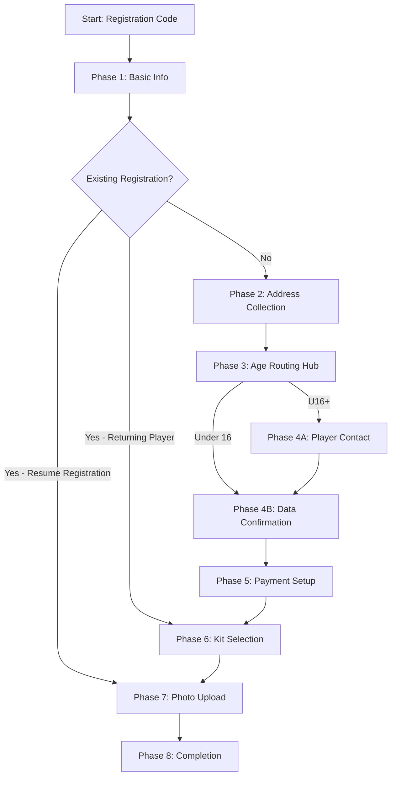

# Registration Workflow Low-Level Design (LLD)
## UTJFC 35-Step Registration Process

### Table of Contents
1. [Workflow Overview](#workflow-overview)
2. [Phase Breakdown](#phase-breakdown)
3. [Age-Based Routing System](#age-based-routing-system)
4. [Business Logic Implementation](#business-logic-implementation)
5. [Dynamic Instruction Injection](#dynamic-instruction-injection)
6. [Validation Patterns](#validation-patterns)
7. [Tool Integration Points](#tool-integration-points)
8. [Special Routing Logic](#special-routing-logic)
9. [Data Collection Schema](#data-collection-schema)
10. [Error Handling & Recovery](#error-handling--recovery)
11. [Payment Integration Flow](#payment-integration-flow)
12. [Kit Management System](#kit-management-system)
13. [Photo Upload Process](#photo-upload-process)
14. [Completion & Handoff](#completion--handoff)

---

## Workflow Overview

### Registration Process Architecture
The UTJFC registration system implements a sophisticated 35-step conversational workflow that guides parents through the complete player registration process. The system intelligently branches based on player age, previous club history, and other factors.



### Key Characteristics
- **35 distinct routines** with specialized validation
- **Registration resume capability** - detects existing registrations at routine 2
- **Age-based branching** at routine 22
- **Dynamic instruction injection** based on context
- **Tool integration** for external service validation
- **Error recovery** with intelligent fallbacks
- **Business rule enforcement** throughout the flow
- **Smart routing** - bypasses completed steps for returning users

---

## Phase Breakdown

### Phase 1: Basic Information Collection (Routines 1-11)

#### Routine 1: Parent Name Collection
```python
# Location: registration_routines.py:8
Task: 
1) Take parent's first and last name (minimum 2 parts)
2) Validate: letters, apostrophes, hyphens, spaces only
3) Convert curly apostrophes (', ') to straight (')
4) Ensure at least 2 words, not single letters
5) If invalid: routine_number = 1, ask for clarification
6) If valid: routine_number = 2, ask for child's name (using parent's first name)
```

#### Routine 2: Child Name Collection with Registration Resume Detection
```python
# Location: registration_routines.py:10
Task:
1) Take child's first and last name (minimum 2 parts)
2) Same validation as parent name
3) If invalid: routine_number = 2
4) If valid: **Call check_if_record_exists_in_db function**
5) **RESTART CHAT LOGIC**: Check if existing registration found
   a) If NO record found: routine_number = 3, ask for date of birth (new registration)
   b) If record found: Route based on 'played_for_urmston_town_last_season' field:
      - If 'N': routine_number = 32 (returning player, needs kit)  
      - If 'Y': Call check_if_kit_needed function:
        * If kit NOT needed: routine_number = 34 (photo upload)
        * If kit needed: routine_number = 32 (kit selection)
```

#### Routine 3: Date of Birth Validation
```python
# Location: registration_routines.py:12
Task:
1) Accept any date format (DD/MM/YYYY, MM/DD/YYYY, DD-MM-YYYY)
2) Convert to DD-MM-YYYY format
3) Validate: birth year 2007 or later (club rule)
4) Ensure not in future, must be real date
5) If invalid: routine_number = 3
6) If valid: routine_number = 4, ask for gender
```

#### Routine 4: Gender Collection
```python
# Location: registration_routines.py:14
Task:
1) Accept: 'Male', 'Female', 'Not disclosed'
2) Normalize variations (boy/girl, man/woman, prefer not to say)
3) If unclear: routine_number = 4
4) If valid: routine_number = 5, ask about medical issues
```

#### Routine 5: Medical Issues Assessment
```python
# Location: registration_routines.py:16
Task:
1) Accept Yes/No response (normalize variations)
2) If Yes: ask for details, structure as comma-separated list
3) **CRITICAL**: For serious conditions (allergies requiring EpiPen, 
   asthma inhaler, diabetes, epilepsy, heart conditions), ask follow-up:
   "Is there anything important we need to know about this condition?"
4) If invalid: routine_number = 5
5) If valid: routine_number = 6, ask about previous season
```

#### Routines 6-11: Contact & Relationship
- **Routine 6**: Previous team history
- **Routine 7**: Parent relationship (Mother/Father/Guardian/Other)
- **Routine 8**: Mobile phone (UK format: 07..., 11 digits)
- **Routine 9**: Email validation
- **Routine 10**: Communication consent
- **Routine 11**: Parent date of birth

### Phase 2: Address Collection (Routines 12-21)

#### Smart Address Lookup System
```python
# Routine 12: Postcode Collection
Task: Clean postcode (remove spaces, uppercase), validate UK format

# Routine 13: House Number + API Lookup
Task: 
1) Take house number (accept any format: 12a, 5B, Flat 2)
2) Use 'address_lookup' function with postcode + house number
3) If lookup fails: routine_number = 14 (manual entry)
4) If success: routine_number = 15 (confirm address)

# Routine 14: Manual Address Entry (Fallback)
Task:
1) Manual full address entry
2) Visual validation: house number/name, street, area/town, UK postcode
3) Check for Manchester/Stretford/Urmston area
4) If incomplete: routine_number = 14
5) If complete: routine_number = 15

# Routine 15: Address Confirmation
Task:
1) Show formatted address for confirmation
2) If wrong: routine_number = 14 (back to manual)
3) If correct: routine_number = 16
```

#### Child Address Logic (Routines 16-21)
```python
# Routine 16: Same Address Check
Task:
1) Ask if child lives at same address as parent
2) If Yes: routine_number = 22 (skip child address collection)
3) If No: routine_number = 18 (collect child address)

# Routines 18-21: Child Address Collection
# Mirror of routines 12-15 but for child's address
# Same postcode → house number → lookup → confirmation flow
```

---

## Age-Based Routing System

### Routine 22: Critical Routing Hub
```python
# Location: registration_routines.py:50
# This is the most complex routing decision in the system

def handle_routine_22_logic():
    """
    Age-based routing that determines entire workflow path.
    Processes server-side without user input.
    """
    
    # 1. Extract age group from conversation history
    age_group = extract_age_from_history("Age group: U##")
    
    # 2. Route based on age
    if age_group >= "U16":
        # Route to U16+ flow
        routine_number = 23
        message = f"Since {child_name} is 16+, need separate contact details"
        
    else:
        # Route to under-16 flow  
        routine_number = 28
        message = "Thank you for all the information, please confirm details"
    
    return routine_number, message
```

### Age Group Calculation
```python
# Age determination logic
birth_year = extract_birth_year_from_dob()
current_season = "2024-25"
season_cutoff_date = "31-08-2024"  # August 31st cutoff

# Calculate age group based on birth year and season
if birth_year >= 2007:
    age_group = calculate_age_group(birth_year, season_cutoff_date)
else:
    # Reject: Club rule - must be born 2007 or later
```

---

## Business Logic Implementation

### Age-Based Path Differences

#### U16+ Players (Routines 23-24)
```python
# Routine 23: Player Mobile Number
Task:
1) Collect child's own mobile number
2) Validate UK format (07..., 11 digits)
3) **CRITICAL**: Must be different from parent's number
4) Cross-reference conversation history for parent's number
5) If same as parent: routine_number = 23, explain need for different number

# Routine 24: Player Email Address
Task:
1) Collect child's email address
2) Validate email format (@ and domain)
3) **CRITICAL**: Must be different from parent's email
4) If same as parent: routine_number = 24, explain need for different email
5) If valid: routine_number = 28 (converge with under-16 flow)
```

#### Under 16 Players
- Skip routines 23-24 entirely
- Use parent contact details only
- Jump directly from routine 22 to routine 28

### Kit Requirement Logic
```python
# Location: routine 30 business logic

def determine_kit_requirement():
    """Complex kit requirement determination."""
    
    # Check previous season participation
    played_last_season = check_conversation_history("played for Urmston Town last season")
    
    if not played_last_season:
        # New players always need kit
        return "needs_kit", "New player requires kit"
    
    else:
        # Existing players: check if team needs new kit
        result = call_tool("check_if_kit_needed", {
            "team": team_name,
            "age_group": age_group
        })
        
        if result["kit_needed"]:
            return "needs_kit", "Team requires new kit this season"
        else:
            return "no_kit", "Can continue with existing kit"
```

### Payment Structure
```python
# Standard pricing (applied in routine 29)
SIGNING_FEE = 45.00  # GBP - one-time annual fee
MONTHLY_FEE = 27.50  # GBP - September to May (9 months)

# Sibling discount (applied automatically at GoCardless level)
SIBLING_DISCOUNT = 0.10  # 10% off monthly fee
# £27.50 → £24.75 for additional siblings
```

---

## Dynamic Instruction Injection

### Instruction Template System
```python
# Location: registration_agent/agents_reg.py:116-121

class Agent:
    def get_instructions_with_routine(self, routine_message: str = ""):
        """
        Inject routine-specific instructions into base prompt.
        
        Base instructions contain placeholder:
        CURRENT STEP INSTRUCTIONS:
        {routine_instructions}
        """
        return self.instructions.format(routine_instructions=routine_message)
```

### Runtime Injection Process
```python
# Location: server.py routine processing

def create_dynamic_agent(routine_number: int):
    """Create agent with routine-specific instructions."""
    
    # 1. Get routine message
    routines = RegistrationRoutines()
    routine_message = routines.get_routine_message(routine_number)
    
    # 2. Inject into base instructions
    dynamic_instructions = new_registration_agent.get_instructions_with_routine(
        routine_message
    )
    
    # 3. Create specialized agent
    return Agent(
        name=new_registration_agent.name,
        model=new_registration_agent.model,
        instructions=dynamic_instructions,
        tools=new_registration_agent.tools
    )
```

---

## Validation Patterns

### Data Validation Strategy

#### Name Validation (Routines 1-2)
```python
def validate_name(name: str) -> dict:
    """
    Comprehensive name validation.
    """
    # 1. Character validation
    allowed_chars = re.compile(r"^[a-zA-Z\s\-']+$")
    if not allowed_chars.match(name):
        return {"valid": False, "error": "Invalid characters"}
    
    # 2. Apostrophe normalization
    name = name.replace("'", "'").replace("'", "'")
    
    # 3. Word count validation
    words = name.strip().split()
    if len(words) < 2:
        return {"valid": False, "error": "Minimum 2 words required"}
    
    # 4. Single letter check
    if any(len(word) == 1 for word in words):
        return {"valid": False, "error": "No single letters allowed"}
    
    return {"valid": True, "normalized": name}
```

#### Phone Number Validation (Routines 8, 23)
```python
def validate_uk_mobile(phone: str) -> dict:
    """
    UK mobile number validation.
    """
    # Remove formatting
    clean_phone = re.sub(r'[\s\-\(\)]', '', phone)
    
    # UK mobile pattern: 07xxxxxxxxx (11 digits total)
    if not re.match(r'^07\d{9}$', clean_phone):
        return {
            "valid": False, 
            "error": "Must be UK mobile format (07...)"
        }
    
    return {"valid": True, "formatted": clean_phone}
```

#### Email Validation (Routines 9, 24)
```python
def validate_email(email: str) -> dict:
    """
    Email format validation.
    """
    email = email.lower().strip()
    
    # Basic email pattern
    if not re.match(r'^[^@]+@[^@]+\.[^@]+$', email):
        return {"valid": False, "error": "Invalid email format"}
    
    return {"valid": True, "normalized": email}
```

---

## Tool Integration Points

### Routine-Tool Mapping

#### Address Tools (Routines 13, 19)
```python
# address_lookup tool integration
"address_lookup": {
    "routine": [13, 19],
    "purpose": "Postcode + house number → full address",
    "api": "Google Places API",
    "fallback": "Manual entry (routines 14, 20)"
}
```

#### Payment Tools (Routine 29)
```python
# Payment processing sequence
1. "create_payment_token": {
    "input": "preferred_payment_day",
    "output": "billing_request_id, payment_amounts",
    "provider": "GoCardless"
}

2. "update_reg_details_to_db": {
    "input": "all_collected_data + payment_amounts",
    "output": "database_record_id",
    "provider": "Airtable"
}
```

#### Kit Tools (Routines 30, 33)
```python
# Kit management sequence
1. "check_if_kit_needed": {
    "input": "team, age_group",
    "output": "kit_required: boolean",
    "logic": "Team-specific kit renewal schedule"
}

2. "check_shirt_number_availability": {
    "input": "team, age_group, requested_number",
    "output": "available: boolean",
    "validation": "Real-time conflict checking"
}

3. "update_kit_details_to_db": {
    "input": "kit_size, shirt_number, kit_type",
    "output": "success: boolean",
    "provider": "Airtable"
}
```

#### Photo Tools (Routine 34)
```python
# Photo processing sequence
1. "upload_photo_to_s3": {
    "input": "photo_file",
    "processing": "HEIC → JPEG conversion",
    "output": "s3_url",
    "provider": "AWS S3"
}

2. "update_photo_link_to_db": {
    "input": "s3_url, filename",
    "output": "success: boolean",
    "provider": "Airtable"
}
```

---

## Special Routing Logic

### Conditional Jumps

#### Same Address Optimization (Routine 16)
```python
# Efficiency optimization for most common case
if child_address == parent_address:
    # Skip routines 17-21 (child address collection)
    next_routine = 22
else:
    # Collect separate child address
    next_routine = 18
```

#### Age-Based Routing (Routine 22)
```python
# Server-side processing without user input
def handle_routine_22_server_side():
    """
    Special server-side routing that doesn't wait for user input.
    """
    
    # Extract age from conversation history
    age_group = extract_age_group_from_history()
    
    # Route without sending response to user
    if age_group >= "U16":
        return create_u16_plus_response(routine_23)
    else:
        return create_under_16_response(routine_28)
```

#### Kit Requirement Branching (Routine 30)
```python
def route_kit_requirements():
    """
    Complex routing based on multiple factors.
    """
    
    # Factor 1: Previous season participation
    played_last_season = check_conversation_history()
    
    if not played_last_season:
        # New players always need kit
        return 32  # Kit selection
    
    # Factor 2: Team kit renewal schedule
    kit_needed = call_tool("check_if_kit_needed")
    
    if kit_needed:
        return 32  # Kit selection
    else:
        return 34  # Skip to photo upload
```

---

## Data Collection Schema

### Complete Registration Data Model
```python
class RegistrationData:
    # Parent Information
    parent_full_name: str           # Routine 1
    parent_relationship: str        # Routine 7 (Mother/Father/Guardian/Other)
    parent_phone: str              # Routine 8 (UK mobile format)
    parent_email: str              # Routine 9
    parent_dob: str                # Routine 11 (DD-MM-YYYY)
    parent_address: str            # Routines 12-15
    communication_consent: str      # Routine 10 (Yes/No)
    
    # Child Information  
    child_full_name: str           # Routine 2
    child_dob: str                 # Routine 3 (DD-MM-YYYY)
    child_gender: str              # Routine 4 (Male/Female/Not disclosed)
    medical_issues: str            # Routine 5 (comma-separated list)
    child_address: str             # Routines 18-21 (if different)
    previous_team: str             # Routine 6
    
    # U16+ Additional Fields
    child_phone: str               # Routine 23 (if U16+)
    child_email: str               # Routine 24 (if U16+)
    
    # Registration Details
    team: str                      # From registration code
    age_group: str                 # Calculated from DOB
    season: str                    # From registration code (2526)
    
    # Payment Information
    preferred_payment_day: int     # Routine 29 (-1 for last day)
    billing_request_id: str        # Generated by GoCardless
    signing_fee_amount: float      # £45.00
    monthly_amount: float          # £27.50 (or £24.75 with sibling discount)
    
    # Kit Information (if required)
    kit_size: str                  # Routine 32 (5/6 to 3XL)
    shirt_number: int              # Routine 33 (1-25)
    kit_type: str                  # goalkeeper/outfield
    
    # Photo Information
    photo_s3_url: str              # Routine 34
    photo_filename: str            # Original filename
    
    # System Fields
    registration_status: str        # active/incomplete/suspended
    created_date: datetime         # Timestamp
    conversation_history: str      # JSON array
```

---

## Error Handling & Recovery

### Validation Error Patterns
```python
def handle_validation_error(routine_number: int, error_type: str):
    """
    Standard error handling pattern for all routines.
    """
    
    # 1. Stay on same routine
    next_routine = routine_number
    
    # 2. Provide helpful error message
    error_messages = {
        "invalid_name": "Please provide a valid name with at least two words",
        "invalid_phone": "Please provide a valid UK mobile number starting with 07",
        "invalid_email": "Please provide a valid email address",
        "invalid_date": "Please provide a valid date"
    }
    
    # 3. Don't expose technical validation details
    return {
        "routine_number": next_routine,
        "message": error_messages.get(error_type, "Please try again")
    }
```

### Recovery Mechanisms
```python
# Address lookup failure recovery
if address_lookup_fails():
    # Automatic fallback to manual entry
    next_routine = 14  # Manual address entry
    
# Payment token creation failure
if payment_token_fails():
    # Provide admin contact for manual assistance
    message = "Please email admin@urmstontownjfc.co.uk for assistance"
    
# Photo upload failure
if photo_upload_fails():
    # Allow retry with guidance
    next_routine = 34
    message = "Please try uploading again or ensure file is a valid image format"
```

---

## Payment Integration Flow

### GoCardless Integration Sequence
```python
# Routine 29: Payment setup
def setup_payment_flow():
    """
    Complete payment integration sequence.
    """
    
    # 1. Create payment token
    payment_result = call_tool("create_payment_token", {
        "preferred_payment_day": preferred_day,
        "signing_fee": 45.00,
        "monthly_amount": 27.50
    })
    
    # 2. Store registration data with payment info
    db_result = call_tool("update_reg_details_to_db", {
        **all_registration_data,
        **payment_result
    })
    
    # 3. Send SMS payment link (automatic)
    # Background process sends SMS to parent_phone
    
    return {
        "routine_number": 30,
        "message": "Payment link sent via SMS - please check your messages!"
    }
```

### Payment Link Generation
```python
# Server endpoint: /reg_setup/{billing_request_id}
def generate_payment_link(billing_request_id: str):
    """
    Convert persistent payment token to fresh GoCardless URL.
    """
    
    # 1. Lookup registration data
    registration = get_registration_by_billing_id(billing_request_id)
    
    # 2. Generate fresh GoCardless URL
    payment_url = gocardless.generate_payment_url(billing_request_id)
    
    # 3. Redirect user to GoCardless
    return redirect(payment_url)
```

---

## Kit Management System

### Kit Size Validation
```python
# Routine 32: Kit size selection
VALID_KIT_SIZES = [
    "5/6", "7/8", "9/10", "11/12", "13/14",  # Youth sizes
    "S", "M", "L", "XL", "2XL", "3XL"        # Adult sizes
]

def normalize_kit_size(user_input: str) -> str:
    """
    Normalize kit size variations.
    """
    # Accept variations: 5-6, 5 to 6, etc.
    normalized = user_input.upper().strip()
    
    size_map = {
        "5-6": "5/6", "5 TO 6": "5/6",
        "7-8": "7/8", "7 TO 8": "7/8",
        # ... etc
    }
    
    return size_map.get(normalized, normalized)
```

### Shirt Number Conflict Resolution
```python
# Routine 33: Shirt number availability
def check_shirt_availability(team: str, age_group: str, number: int):
    """
    Real-time shirt number conflict checking.
    """
    
    # Query current registrations
    conflict_query = f"""
    AND(
        {{team}} = '{team}',
        {{age_group}} = '{age_group}',
        {{shirt_number}} = {number},
        {{registration_status}} = 'active'
    )
    """
    
    existing = airtable.query(conflict_query)
    
    if existing:
        return {
            "available": False,
            "message": f"Number {number} is already taken, please choose another"
        }
    else:
        return {"available": True}
```

---

## Photo Upload Process

### HEIC Conversion Integration
```python
# Routine 34: Photo upload and validation
def process_photo_upload(photo_file):
    """
    Complete photo processing pipeline.
    """
    
    # 1. Validate file format
    allowed_formats = ['.jpg', '.jpeg', '.png', '.heic', '.webp']
    if not any(photo_file.filename.lower().endswith(fmt) for fmt in allowed_formats):
        return {"valid": False, "error": "Invalid file format"}
    
    # 2. HEIC conversion (if needed)
    if photo_file.filename.lower().endswith('.heic'):
        photo_file = convert_heic_to_jpeg(photo_file)
    
    # 3. Upload to S3
    s3_result = call_tool("upload_photo_to_s3", {
        "file": photo_file,
        "player_name": child_name,
        "team": team,
        "age_group": age_group
    })
    
    # 4. Store S3 URL in database
    db_result = call_tool("update_photo_link_to_db", {
        "s3_url": s3_result["url"],
        "filename": photo_file.filename
    })
    
    return {"valid": True, "s3_url": s3_result["url"]}
```

---

## Completion & Handoff

### Registration Completion (Routine 35)
```python
# Final routine: Completion state
def complete_registration():
    """
    Registration completion handling.
    """
    
    return {
        "routine_number": 35,
        "message": """
        🔵 **Registration Complete!** 🟡
        
        Your registration is now complete pending payment.
        
        **Next Steps:**
        1. Complete payment via the SMS link within 7 days
        2. You'll receive SMS confirmation once payment is processed
        3. Watch for club communications via email/SMS
        
        **Questions?** Email admin@urmstontownjfc.co.uk
        
        Welcome to Urmston Town Juniors FC! 🔵⚽🟡
        """,
        "status": "completed_pending_payment"
    }
```

### Webhook Integration Handoff
```python
# After routine 35, system hands off to webhook processing
def webhook_completes_registration():
    """
    GoCardless webhooks complete the registration process.
    """
    
    # 1. Payment confirmed webhook
    # 2. Mandate activated webhook  
    # 3. Subscription created webhook
    # 4. Update registration_status = 'active'
    # 5. Send confirmation SMS
    # 6. Apply sibling discounts if applicable
```

---

## Performance Optimizations

### Routine Caching
```python
# Cache routine messages for performance
class RegistrationRoutines:
    _routine_cache = {}
    
    @classmethod  
    def get_routine_message(cls, routine_number: int) -> str:
        if routine_number not in cls._routine_cache:
            cls._routine_cache[routine_number] = cls.ROUTINES.get(routine_number, "")
        return cls._routine_cache[routine_number]
```

### Conversation History Optimization
```python
# Trim conversation history to prevent memory bloat
MAX_HISTORY_LENGTH = 50

def add_message_to_history(session_id: str, role: str, content: str):
    # Add message
    history.append({"role": role, "content": content})
    
    # Trim if too long
    if len(history) > MAX_HISTORY_LENGTH:
        history = history[-MAX_HISTORY_LENGTH:]
```

---

## Conclusion

The 35-step registration workflow represents a sophisticated conversational AI system that handles complex business requirements while maintaining excellent user experience. Key achievements include:

**Technical Sophistication**:
- Dynamic instruction injection for context-aware AI responses
- Intelligent age-based routing with server-side processing
- Complex validation patterns with graceful error handling
- Seamless tool integration for external service validation

**Business Logic Excellence**:
- Complete payment processing with sibling discount automation
- Kit management with real-time conflict resolution
- Photo upload with HEIC conversion for iOS compatibility
- Comprehensive data collection with privacy considerations

**User Experience Optimization**:
- Natural conversation flow with intelligent fallbacks
- Address lookup with manual entry backup
- Clear progress indication through routine numbers
- Helpful error messages without technical exposure

The workflow successfully demonstrates how AI agents can handle complex, multi-step business processes while maintaining conversation continuity and providing robust error handling.