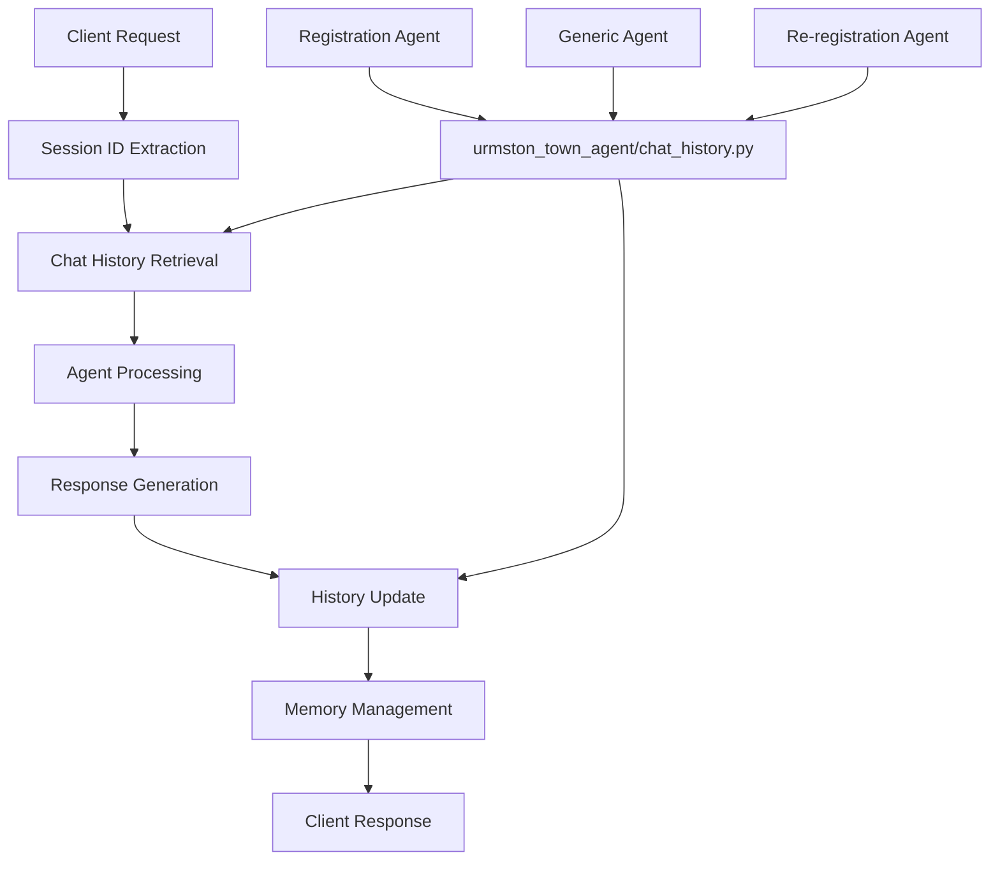

# Session Management Low-Level Design (LLD)
## UTJFC Chat History Architecture & Session State Management

### Table of Contents
1. [Session Architecture Overview](#session-architecture-overview)
2. [Chat History Implementation](#chat-history-implementation)
3. [Session State Management](#session-state-management)
4. [Multi-Agent Session Continuity](#multi-agent-session-continuity)
5. [Memory Management](#memory-management)
6. [Database Integration](#database-integration)
7. [Session Security](#session-security)
8. [Debugging Session Issues](#debugging-session-issues)

---

## Session Architecture Overview

### Centralized History System

The UTJFC backend uses a **centralized chat history system** that maintains session continuity across different agents and conversation flows. All agents (generic, registration, re-registration) use the same history management system.



### Key Characteristics
- **Single Source of Truth**: All agents use `urmston_town_agent/chat_history.py`
- **Session Persistence**: Conversations maintained across agent transitions
- **Memory Management**: Automatic cleanup with 40-turn limit
- **Tool Call Integration**: Tool executions logged in conversation history
- **Database Storage**: Complete history saved during photo upload phase

---

## Chat History Implementation

### Core Module (`urmston_town_agent/chat_history.py`)

#### Primary Functions
```python
def get_session_history(session_id: str) -> List[Dict]:
    """
    Retrieve complete conversation history for a session.
    Returns list of message dictionaries with role and content.
    """

def add_message_to_session_history(session_id: str, role: str, content: str):
    """
    Add a new message to session history with automatic memory management.
    Handles memory cleanup when approaching turn limits.
    """

def clear_session_history(session_id: str):
    """
    Clear all conversation history for a session.
    Used for testing and session reset scenarios.
    """

def set_session_context(session_id: str, context: Dict):
    """
    Store additional session context (agent type, routine number, etc.)
    """
```

#### Session Storage Structure
```python
# In-memory session storage
session_histories = {
    "session_id_1": [
        {"role": "user", "content": "Hello"},
        {"role": "assistant", "content": "Hi! How can I help?"},
        {"role": "system", "content": "UPLOADED_FILE_PATH:/tmp/photo.jpg"}
    ],
    "session_id_2": [...],
    # ... additional sessions
}

# Session context storage
session_contexts = {
    "session_id_1": {
        "last_agent": "new_registration",
        "routine_number": 15,
        "agent_type": "registration"
    }
}
```

### Message Format Standards

#### Standard Message Structure
```python
{
    "role": "user|assistant|system",
    "content": "message content",
    "timestamp": "2025-01-15T10:30:00Z"  # Optional
}
```

#### Tool Call Logging Format
```python
{
    "role": "assistant",
    "content": "🔧 Tool Call: update_reg_details_to_db - Successfully updated registration for John Smith (record: rec123abc)"
}
```

#### System Messages
```python
# File upload tracking
{
    "role": "system", 
    "content": "UPLOADED_FILE_PATH:/tmp/tmpfile_abc123.jpg"
}

# Agent transition tracking
{
    "role": "system",
    "content": "AGENT_TRANSITION: generic → new_registration (routine 1)"
}
```

---

## Session State Management

### Session ID Handling

#### Default Session Management
```python
DEFAULT_SESSION_ID = "default_session_id"

def get_or_create_session_id(request_session_id: str = None) -> str:
    """
    Get session ID from request or create default.
    Ensures every conversation has a tracked session.
    """
    return request_session_id or DEFAULT_SESSION_ID
```

#### Environment Variable Integration
```python
# For tool access during processing
os.environ['CURRENT_SESSION_ID'] = session_id

# Tools can access current session
current_session = os.environ.get('CURRENT_SESSION_ID', 'unknown')
```

### Agent State Persistence

#### Last Agent Tracking
```python
def update_session_agent(session_id: str, agent_type: str, routine_number: int = None):
    """
    Track which agent last handled the session.
    Enables proper agent routing on subsequent messages.
    """
    context = get_session_context(session_id)
    context.update({
        "last_agent": agent_type,
        "routine_number": routine_number,
        "updated_at": datetime.now().isoformat()
    })
    set_session_context(session_id, context)
```

#### Routine Number Persistence
```python
def get_current_routine(session_id: str) -> int:
    """
    Get the current routine number for session.
    Used for conversation flow continuation.
    """
    context = get_session_context(session_id)
    return context.get("routine_number", 1)
```

### Cross-Agent Session Continuity

#### Agent Transition Handling
```python
def transition_agent(session_id: str, from_agent: str, to_agent: str, routine: int = None):
    """
    Handle smooth transition between different agent types.
    Maintains conversation context across agent switches.
    """
    # Log transition in conversation history
    transition_message = f"AGENT_TRANSITION: {from_agent} → {to_agent}"
    if routine:
        transition_message += f" (routine {routine})"
    
    add_message_to_session_history(session_id, "system", transition_message)
    
    # Update session context
    update_session_agent(session_id, to_agent, routine)
```

#### Registration Code Detection Flow
```python
def handle_registration_code_detection(session_id: str, code: str, agent_type: str):
    """
    Manage agent transition when registration code is detected.
    Preserves conversation flow while switching to specialized agent.
    """
    # Validate code and determine agent type
    validation_result = validate_registration_code(code)
    
    if validation_result["success"]:
        # Transition from generic to registration agent
        transition_agent(
            session_id=session_id,
            from_agent="generic",
            to_agent=agent_type,
            routine=1
        )
        
        # Store code details in session context
        context = get_session_context(session_id)
        context.update({
            "registration_code": code,
            "team": validation_result["team"],
            "age_group": validation_result["age_group"],
            "season": validation_result["season"]
        })
        set_session_context(session_id, context)
```

---

## Memory Management

### Turn Limit Implementation (`chat_history.py:7,37`)

#### Configuration
```python
MAX_HISTORY_LENGTH = 40  # Total messages (approximately 20 conversation turns)
```

#### Automatic Cleanup
```python
def add_message_to_session_history(session_id: str, role: str, content: str):
    """
    Add message with automatic memory management.
    Removes oldest messages when approaching limit.
    """
    if session_id not in session_histories:
        session_histories[session_id] = []
    
    # Add new message
    session_histories[session_id].append({
        "role": role,
        "content": content,
        "timestamp": datetime.now().isoformat()
    })
    
    # Memory management - remove oldest messages
    history = session_histories[session_id]
    while len(history) > MAX_HISTORY_LENGTH * 2:  # Each turn = 2 messages (user + assistant)
        removed_message = history.pop(0)
        print(f"🧹 Memory cleanup: Removed oldest message from session {session_id}")
```

### Memory Optimization Strategies

#### Important Message Preservation
```python
def preserve_important_messages(history: List[Dict]) -> List[Dict]:
    """
    Preserve system messages and key conversation points during cleanup.
    Ensures critical information isn't lost during memory management.
    """
    preserved_messages = []
    regular_messages = []
    
    for message in history:
        # Preserve system messages, agent transitions, and tool calls
        if (message["role"] == "system" or 
            "AGENT_TRANSITION" in message.get("content", "") or
            "🔧 Tool Call:" in message.get("content", "") or
            "UPLOADED_FILE_PATH:" in message.get("content", "")):
            preserved_messages.append(message)
        else:
            regular_messages.append(message)
    
    # Keep all preserved messages + most recent regular messages
    max_regular = MAX_HISTORY_LENGTH - len(preserved_messages)
    if max_regular > 0:
        regular_messages = regular_messages[-max_regular:]
    
    return preserved_messages + regular_messages
```

#### Session Size Monitoring
```python
def get_session_memory_stats(session_id: str) -> Dict[str, Any]:
    """
    Get memory usage statistics for a session.
    Used for debugging and optimization.
    """
    history = get_session_history(session_id)
    
    total_messages = len(history)
    total_chars = sum(len(msg.get("content", "")) for msg in history)
    
    message_types = {}
    for msg in history:
        role = msg.get("role", "unknown")
        message_types[role] = message_types.get(role, 0) + 1
    
    return {
        "total_messages": total_messages,
        "total_characters": total_chars,
        "message_types": message_types,
        "memory_usage_percent": (total_messages / (MAX_HISTORY_LENGTH * 2)) * 100
    }
```

---

## Database Integration

### Conversation History Storage

#### Database Storage Trigger
Conversation history is stored in the database during **routine 34 (photo upload)** as part of the registration completion process:

```python
def store_conversation_in_database(session_id: str, record_id: str):
    """
    Store complete conversation history in Airtable during photo upload.
    This creates a permanent record of the registration conversation.
    """
    session_history = get_session_history(session_id)
    
    # Format conversation for database storage
    conversation_json = json.dumps(session_history, indent=2)
    
    # Update Airtable record with conversation history
    update_data = {
        "conversation_history": conversation_json,
        "conversation_stored_at": datetime.now().isoformat(),
        "total_messages": len(session_history)
    }
    
    # Update registration record
    table.update(record_id, update_data)
```

#### Storage Format in Database
```json
{
  "conversation_history": [
    {
      "role": "user",
      "content": "200-Lions-U10-2526",
      "timestamp": "2025-01-15T10:00:00Z"
    },
    {
      "role": "assistant", 
      "content": "Great! I can help you register for Lions U10. Let's start with your child's details...",
      "timestamp": "2025-01-15T10:00:05Z"
    },
    {
      "role": "assistant",
      "content": "🔧 Tool Call: validate_registration_code - Valid code for Lions U10 2025-26 season",
      "timestamp": "2025-01-15T10:00:03Z"
    }
  ]
}
```

### Session Recovery

#### Database-Driven Session Recovery
```python
def recover_session_from_database(record_id: str) -> str:
    """
    Recover session state from database conversation history.
    Used for resuming interrupted registrations.
    """
    try:
        # Get record from database
        record = table.get(record_id)
        conversation_history = record["fields"].get("conversation_history")
        
        if conversation_history:
            # Parse stored conversation
            history = json.loads(conversation_history)
            
            # Generate new session ID
            new_session_id = f"recovered_{record_id}_{int(time.time())}"
            
            # Restore conversation history
            session_histories[new_session_id] = history
            
            # Extract session context from conversation
            last_routine = extract_routine_from_history(history)
            update_session_agent(new_session_id, "new_registration", last_routine)
            
            return new_session_id
            
    except Exception as e:
        print(f"Session recovery failed: {e}")
        return None
```

---

## Session Security

### Session ID Security

#### Session ID Generation
```python
import secrets
import time

def generate_secure_session_id() -> str:
    """
    Generate cryptographically secure session ID.
    Used for sensitive registration conversations.
    """
    timestamp = str(int(time.time()))
    random_part = secrets.token_urlsafe(16)
    return f"utjfc_{timestamp}_{random_part}"
```

#### Session Validation
```python
def validate_session_id(session_id: str) -> bool:
    """
    Validate session ID format and security.
    Prevents session hijacking and injection attacks.
    """
    # Check format
    if not isinstance(session_id, str) or len(session_id) > 100:
        return False
    
    # Allow alphanumeric, hyphens, underscores only
    import re
    if not re.match(r'^[a-zA-Z0-9_-]+$', session_id):
        return False
    
    return True
```

### Data Protection

#### Sensitive Information Handling
```python
def sanitize_message_for_logging(message: str) -> str:
    """
    Remove sensitive information from messages before logging.
    Protects personal data in system logs.
    """
    # Patterns to redact
    patterns = [
        (r'\b\d{11}\b', '[PHONE_REDACTED]'),  # UK phone numbers
        (r'\b[A-Za-z0-9._%+-]+@[A-Za-z0-9.-]+\.[A-Z|a-z]{2,}\b', '[EMAIL_REDACTED]'),  # Email
        (r'\b[A-Z]{1,2}\d[A-Z\d]?\s*\d[A-Z]{2}\b', '[POSTCODE_REDACTED]'),  # UK postcodes
    ]
    
    sanitized = message
    for pattern, replacement in patterns:
        sanitized = re.sub(pattern, replacement, sanitized, flags=re.IGNORECASE)
    
    return sanitized
```

#### Session Expiration
```python
def cleanup_expired_sessions():
    """
    Remove old sessions to prevent memory leaks and maintain security.
    Run periodically to clean up abandoned sessions.
    """
    current_time = time.time()
    session_timeout = 24 * 60 * 60  # 24 hours
    
    expired_sessions = []
    for session_id in list(session_histories.keys()):
        # Check last activity time
        history = session_histories[session_id]
        if history:
            last_message = history[-1]
            if "timestamp" in last_message:
                last_time = datetime.fromisoformat(last_message["timestamp"]).timestamp()
                if current_time - last_time > session_timeout:
                    expired_sessions.append(session_id)
    
    # Remove expired sessions
    for session_id in expired_sessions:
        del session_histories[session_id]
        if session_id in session_contexts:
            del session_contexts[session_id]
        print(f"🧹 Cleaned up expired session: {session_id}")
```

---

## Debugging Session Issues

### Session Inspection Tools

#### Session History Analysis
```python
def debug_session_history(session_id: str):
    """
    Comprehensive session debugging information.
    """
    history = get_session_history(session_id)
    context = get_session_context(session_id)
    
    print(f"=== Session Debug: {session_id} ===")
    print(f"Total messages: {len(history)}")
    print(f"Current agent: {context.get('last_agent', 'unknown')}")
    print(f"Current routine: {context.get('routine_number', 'unknown')}")
    
    # Message type breakdown
    message_types = {}
    for msg in history:
        role = msg.get("role", "unknown")
        message_types[role] = message_types.get(role, 0) + 1
    
    print(f"Message breakdown: {message_types}")
    
    # Recent messages
    print("\nRecent messages:")
    for i, msg in enumerate(history[-5:]):
        print(f"  {i+1}. [{msg.get('role')}]: {msg.get('content', '')[:100]}...")
    
    # Tool calls
    tool_calls = [msg for msg in history if "🔧 Tool Call:" in msg.get("content", "")]
    print(f"\nTool calls: {len(tool_calls)}")
    for tool_call in tool_calls[-3:]:
        print(f"  - {tool_call.get('content', '')}")
```

#### Session Flow Visualization
```python
def visualize_session_flow(session_id: str):
    """
    Create a visual representation of conversation flow.
    """
    history = get_session_history(session_id)
    
    print(f"=== Session Flow: {session_id} ===")
    
    routine_changes = []
    agent_changes = []
    
    for msg in history:
        content = msg.get("content", "")
        
        # Track routine changes
        if "routine" in content.lower():
            routine_changes.append(content)
        
        # Track agent transitions
        if "AGENT_TRANSITION" in content:
            agent_changes.append(content)
    
    print("Agent transitions:")
    for transition in agent_changes:
        print(f"  → {transition}")
    
    print(f"\nRoutine progression ({len(routine_changes)} changes):")
    for routine in routine_changes[-5:]:
        print(f"  → {routine[:80]}...")
```

### Common Session Issues

#### Issue: Lost Session Context
**Symptoms**: Agent doesn't remember previous conversation
**Diagnosis**:
```python
# Check if session exists
if session_id not in session_histories:
    print(f"❌ Session {session_id} not found in memory")

# Check history length
history = get_session_history(session_id)
if len(history) == 0:
    print(f"❌ Session {session_id} has empty history")
```

**Solutions**:
- Verify session ID consistency across requests
- Check memory cleanup hasn't removed critical messages
- Implement session recovery from database if needed

#### Issue: Memory Limit Reached
**Symptoms**: Important information lost during conversation
**Diagnosis**:
```python
stats = get_session_memory_stats(session_id)
if stats["memory_usage_percent"] > 90:
    print(f"⚠️ Session approaching memory limit: {stats['memory_usage_percent']:.1f}%")
```

**Solutions**:
- Implement important message preservation
- Consider increasing memory limit for complex registrations
- Store intermediate state in database

#### Issue: Agent Transition Problems
**Symptoms**: Wrong agent type handling requests
**Diagnosis**:
```python
context = get_session_context(session_id)
print(f"Current agent: {context.get('last_agent')}")
print(f"Expected agent: {expected_agent_type}")
```

**Solutions**:
- Verify agent transition logging
- Check registration code validation
- Ensure proper context updates

---

## Conclusion

The UTJFC session management system provides robust, scalable conversation state management that supports complex multi-agent workflows. The centralized chat history architecture ensures consistency across different agent types while maintaining performance through intelligent memory management.

Key features include:
- **Centralized Management**: Single source of truth for all conversation history
- **Multi-Agent Support**: Seamless transitions between different agent types
- **Memory Efficiency**: Automatic cleanup with important message preservation
- **Database Integration**: Permanent storage of complete conversations
- **Security Features**: Session validation and data protection
- **Debugging Tools**: Comprehensive session inspection and analysis

The system is designed to handle the complex conversational flows required for football club registration while maintaining session continuity and data integrity throughout the process.