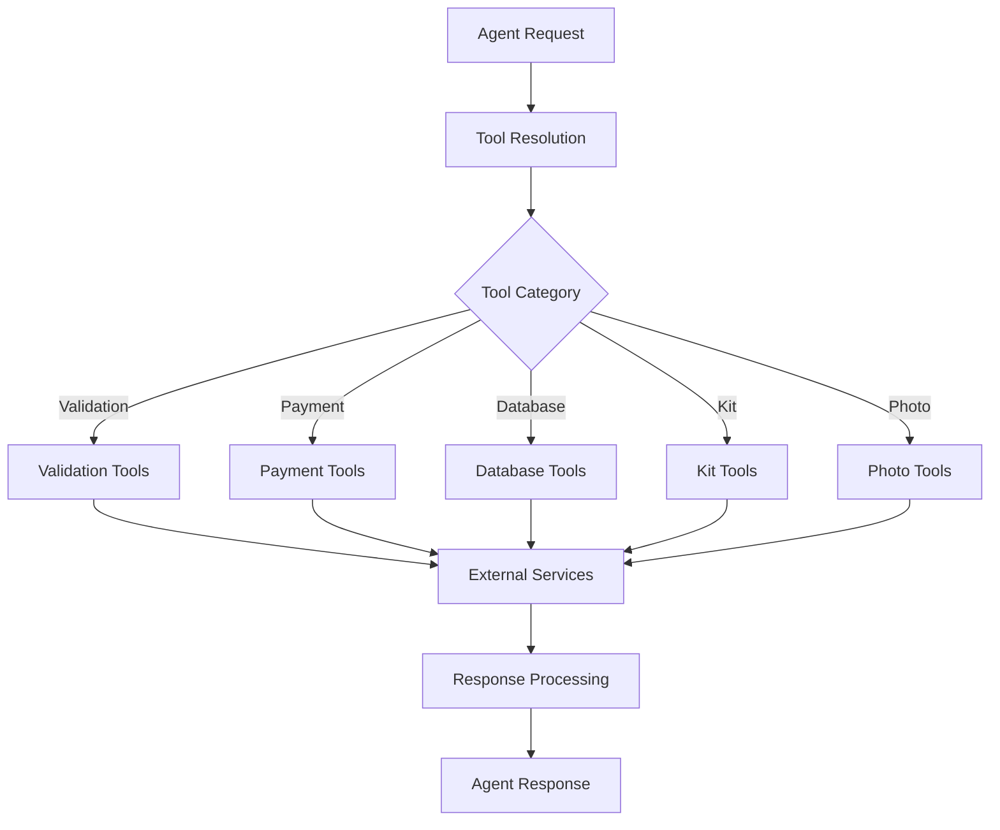

# Tools Ecosystem Low-Level Design (LLD)
## UTJFC Backend Tool System Architecture

### Table of Contents
1. [Ecosystem Overview](#ecosystem-overview)
2. [Tool Architecture Patterns](#tool-architecture-patterns)
3. [Tool Categories](#tool-categories)
4. [Registration & Invocation System](#registration--invocation-system)
5. [Data Validation Framework](#data-validation-framework)
6. [External Service Integration](#external-service-integration)
7. [Error Handling Patterns](#error-handling-patterns)
8. [Tool Orchestration](#tool-orchestration)
9. [Performance Considerations](#performance-considerations)
10. [Security Implementation](#security-implementation)

---

## Ecosystem Overview

### Tool System Architecture
The UTJFC backend implements a comprehensive tool ecosystem with 15+ specialized functions that handle validation, external service integration, and data processing. Tools are designed as modular, reusable components that agents can invoke during conversational workflows.



### Tool Organization Structure
```
registration_agent/tools/
├── airtable/                    # Database operations
│   ├── airtable_tool_definition.py
│   └── table_schema/
├── registration_tools/          # Specialized registration tools
│   ├── validation tools (5)
│   ├── address tools (2)
│   ├── payment tools (3)
│   ├── database tools (4)
│   ├── kit tools (2)
│   └── photo tools (1)
└── README.md                    # Tool documentation
```

---

## Tool Architecture Patterns

### Standard Tool Structure

#### Tool Definition Pattern
```python
# Location: registration_agent/tools/registration_tools/*_tool.py

# 1. OpenAI Function Schema Definition
TOOL_NAME_TOOL = {
    "type": "function",
    "function": {
        "name": "tool_function_name",
        "description": "Tool purpose and usage",
        "parameters": {
            "type": "object",
            "properties": {
                "param1": {
                    "type": "string",
                    "description": "Parameter description"
                }
            },
            "required": ["param1"]
        }
    }
}

# 2. Handler Function
def handle_tool_function(arguments: dict) -> dict:
    """
    Process tool execution with error handling.
    """
    try:
        # Business logic implementation
        result = process_tool_logic(arguments)
        return {"success": True, "result": result}
    except Exception as e:
        return {"success": False, "error": str(e)}
```

#### Data Validation Integration
```python
# Location: registration_agent/tools/registration_tools/registration_data_models.py

class RegistrationDataContract(BaseModel):
    """
    Comprehensive data validation model with 50+ fields.
    """
    # Parent Information
    parent_full_name: Optional[str] = Field(None, description="Parent's full name")
    parent_phone: Optional[str] = Field(None, description="Parent's mobile number")
    parent_email: Optional[str] = Field(None, description="Parent's email address")
    
    # Child Information
    child_full_name: Optional[str] = Field(None, description="Child's full name")
    child_dob: Optional[str] = Field(None, description="Child's date of birth")
    child_gender: Optional[str] = Field(None, description="Child's gender")
    
    # Registration Details
    team: Optional[str] = Field(None, description="Team name")
    age_group: Optional[str] = Field(None, description="Age group")
    season: Optional[str] = Field(None, description="Season identifier")
    
    # ... 40+ additional fields
```

---

## Tool Categories

### 1. Validation Tools

#### Person Name Validation
```python
# Location: registration_agent/tools/registration_tools/person_name_validation_tool.py

PERSON_NAME_VALIDATION_TOOL = {
    "type": "function",
    "function": {
        "name": "person_name_validation",
        "description": "Validate person names for proper format and content",
        "parameters": {
            "type": "object", 
            "properties": {
                "name": {
                    "type": "string",
                    "description": "The name to validate"
                }
            },
            "required": ["name"]
        }
    }
}

def handle_person_name_validation(arguments: dict) -> dict:
    """
    Comprehensive name validation with normalization.
    """
    name = arguments.get("name", "").strip()
    
    # 1. Character validation (letters, spaces, hyphens, apostrophes)
    if not re.match(r"^[a-zA-Z\s\-']+$", name):
        return {"valid": False, "error": "Invalid characters in name"}
    
    # 2. Apostrophe normalization (curly → straight)
    name = name.replace("'", "'").replace("'", "'")
    
    # 3. Word count validation (minimum 2 words)
    words = name.split()
    if len(words) < 2:
        return {"valid": False, "error": "Name must have at least 2 words"}
    
    # 4. Single letter check
    if any(len(word) == 1 for word in words):
        return {"valid": False, "error": "Single letters not allowed"}
    
    return {
        "valid": True,
        "normalized_name": name,
        "word_count": len(words)
    }
```

#### Child Date of Birth Validation
```python
# Location: registration_agent/tools/registration_tools/child_dob_validation_tool.py

def handle_child_dob_validation(arguments: dict) -> dict:
    """
    Validate child's date of birth with club rules.
    """
    dob_str = arguments.get("dob", "").strip()
    
    try:
        # 1. Parse multiple date formats
        date_formats = ["%d-%m-%Y", "%d/%m/%Y", "%m/%d/%Y", "%Y-%m-%d"]
        parsed_date = None
        
        for fmt in date_formats:
            try:
                parsed_date = datetime.strptime(dob_str, fmt)
                break
            except ValueError:
                continue
        
        if not parsed_date:
            return {"valid": False, "error": "Invalid date format"}
        
        # 2. Club rule: Must be born 2007 or later
        if parsed_date.year < 2007:
            return {"valid": False, "error": "Child must be born 2007 or later"}
        
        # 3. Future date check
        if parsed_date > datetime.now():
            return {"valid": False, "error": "Date cannot be in the future"}
        
        # 4. Format standardization (DD-MM-YYYY)
        formatted_dob = parsed_date.strftime("%d-%m-%Y")
        
        return {
            "valid": True,
            "formatted_dob": formatted_dob,
            "birth_year": parsed_date.year,
            "age_group": calculate_age_group(parsed_date)
        }
        
    except Exception as e:
        return {"valid": False, "error": f"Date validation failed: {str(e)}"}
```

### 2. Address Tools

#### Address Lookup
```python
# Location: registration_agent/tools/registration_tools/address_lookup_tool.py

ADDRESS_LOOKUP_TOOL = {
    "type": "function",
    "function": {
        "name": "address_lookup",
        "description": "Look up full address using postcode and house number",
        "parameters": {
            "type": "object",
            "properties": {
                "postcode": {
                    "type": "string",
                    "description": "UK postcode"
                },
                "house_number": {
                    "type": "string", 
                    "description": "House number or name"
                }
            },
            "required": ["postcode", "house_number"]
        }
    }
}

def handle_address_lookup(arguments: dict) -> dict:
    """
    Address lookup using multiple service providers.
    """
    postcode = arguments.get("postcode", "").strip().upper()
    house_number = arguments.get("house_number", "").strip()
    
    try:
        # 1. Try Royal Mail API first
        result = royal_mail_lookup(postcode, house_number)
        if result["success"]:
            return {
                "success": True,
                "address": result["formatted_address"],
                "provider": "royal_mail"
            }
        
        # 2. Fallback to Google Places API
        result = google_places_lookup(postcode, house_number)
        if result["success"]:
            return {
                "success": True,
                "address": result["formatted_address"],
                "provider": "google_places"
            }
        
        # 3. No results found
        return {
            "success": False,
            "error": "Address not found",
            "postcode": postcode,
            "house_number": house_number
        }
        
    except Exception as e:
        return {
            "success": False,
            "error": f"Address lookup failed: {str(e)}"
        }
```

### 3. Payment Processing Tools

#### Payment Token Creation
```python
# Location: registration_agent/tools/registration_tools/create_payment_token_tool.py

CREATE_PAYMENT_TOKEN_TOOL = {
    "type": "function",
    "function": {
        "name": "create_payment_token",
        "description": "Create GoCardless payment token for registration fees",
        "parameters": {
            "type": "object",
            "properties": {
                "preferred_payment_day": {
                    "type": "integer",
                    "description": "Preferred monthly payment day (1-28 or -1 for last day)"
                }
            },
            "required": ["preferred_payment_day"]
        }
    }
}

def handle_create_payment_token(arguments: dict) -> dict:
    """
    Create GoCardless billing request for registration payments.
    """
    try:
        preferred_day = arguments.get("preferred_payment_day")
        
        # 1. Validate payment day
        if preferred_day not in range(-1, 29) or preferred_day == 0:
            return {
                "success": False,
                "error": "Invalid payment day. Must be 1-28 or -1 for last day"
            }
        
        # 2. Standard fees
        signing_fee_pence = 4500  # £45.00
        monthly_fee_pence = 2750  # £27.50
        
        # 3. Create GoCardless billing request
        billing_request = gocardless_client.billing_requests.create(
            params={
                "payment_request": {
                    "amount": signing_fee_pence,
                    "currency": "GBP",
                    "description": "UTJFC Registration Signing Fee"
                },
                "mandate_request": {
                    "currency": "GBP",
                    "verify": "recommended",
                    "scheme": "bacs"
                }
            }
        )
        
        # 4. Generate payment URL
        payment_url = f"{base_url}/reg_setup/{billing_request.id}"
        
        return {
            "success": True,
            "billing_request_id": billing_request.id,
            "payment_url": payment_url,
            "signing_fee_amount_pounds": 45.00,
            "monthly_amount_pounds": 27.50,
            "preferred_payment_day": preferred_day
        }
        
    except Exception as e:
        return {
            "success": False,
            "error": f"Payment token creation failed: {str(e)}"
        }
```

### 4. Database Operation Tools

#### Registration Resume Detection
```python
# Location: registration_agent/tools/registration_tools/check_if_record_exists_in_db_tool.py
CHECK_IF_RECORD_EXISTS_IN_DB_TOOL = {
    "type": "function",
    "function": {
        "name": "check_if_record_exists_in_db",
        "description": "Search for existing registration by player and parent names",
        "parameters": {
            "type": "object",
            "properties": {
                "player_full_name": {
                    "type": "string",
                    "description": "Child's full name with proper capitalization"
                },
                "parent_full_name": {
                    "type": "string", 
                    "description": "Parent's full name with proper capitalization"
                }
            },
            "required": ["player_full_name", "parent_full_name"]
        }
    }
}

def check_if_record_exists_in_db(**kwargs):
    """
    Core function that enables registration resume functionality.
    
    Purpose: Detect when users are returning to complete a registration
    after disconnection (especially at payment SMS step).
    
    Process:
    1. Search Airtable using exact name matching
    2. Return complete record data for routing decisions
    3. Include record_id for subsequent database operations
    
    Returns:
    - success: bool - Whether search completed successfully
    - record_found: bool - Whether matching record exists
    - record: dict - Complete record fields for routing
    - record_id: str - Airtable record ID for updates
    - message: str - Status description
    """
    # Implementation details in check_if_record_exists_in_db.py
```

#### Registration Data Update
```python
# Location: registration_agent/tools/registration_tools/update_reg_details_to_db_tool_ai_friendly.py

UPDATE_REG_DETAILS_TO_DB_AI_FRIENDLY_TOOL = {
    "type": "function",
    "function": {
        "name": "update_reg_details_to_db",
        "description": "Update registration details in Airtable database",
        "parameters": {
            "type": "object",
            "properties": {
                "data": {
                    "type": "object",
                    "description": "Registration data to store",
                    "additionalProperties": True
                }
            },
            "required": ["data"]
        }
    }
}

def update_reg_details_to_db_ai_friendly(arguments: dict) -> dict:
    """
    Update registration details with comprehensive data validation.
    """
    try:
        raw_data = arguments.get("data", {})
        
        # 1. Validate using Pydantic model
        validated_data = RegistrationDataContract(**raw_data)
        
        # 2. Convert to Airtable format
        airtable_data = {
            "parent_full_name": validated_data.parent_full_name,
            "parent_phone": validated_data.parent_phone,
            "parent_email": validated_data.parent_email,
            "child_full_name": validated_data.child_full_name,
            "child_dob": validated_data.child_dob,
            "child_gender": validated_data.child_gender,
            "team": validated_data.team,
            "age_group": validated_data.age_group,
            "season": validated_data.season,
            "registration_status": "incomplete",
            "created_date": datetime.now().isoformat()
        }
        
        # 3. Create or update Airtable record
        table = get_airtable_table("registrations_2526")
        
        # Check for existing record
        existing = find_existing_registration(validated_data)
        
        if existing:
            record = table.update(existing["id"], airtable_data)
        else:
            record = table.create(airtable_data)
        
        return {
            "success": True,
            "record_id": record["id"],
            "action": "updated" if existing else "created"
        }
        
    except ValidationError as e:
        return {
            "success": False,
            "error": f"Data validation failed: {str(e)}"
        }
    except Exception as e:
        return {
            "success": False,
            "error": f"Database update failed: {str(e)}"
        }
```

### 5. Kit Management Tools

#### Shirt Number Availability
```python
# Location: registration_agent/tools/registration_tools/check_shirt_number_availability_tool.py

CHECK_SHIRT_NUMBER_AVAILABILITY_TOOL = {
    "type": "function",
    "function": {
        "name": "check_shirt_number_availability",
        "description": "Check if shirt number is available for team/age group",
        "parameters": {
            "type": "object",
            "properties": {
                "team": {"type": "string", "description": "Team name"},
                "age_group": {"type": "string", "description": "Age group"},
                "requested_shirt_number": {"type": "integer", "description": "Requested shirt number"}
            },
            "required": ["team", "age_group", "requested_shirt_number"]
        }
    }
}

def check_shirt_number_availability(arguments: dict) -> dict:
    """
    Real-time shirt number conflict checking.
    """
    try:
        team = arguments.get("team")
        age_group = arguments.get("age_group") 
        number = arguments.get("requested_shirt_number")
        
        # 1. Validate shirt number range
        if not 1 <= number <= 25:
            return {
                "available": False,
                "error": "Shirt number must be between 1 and 25"
            }
        
        # 2. Query existing registrations
        table = get_airtable_table("registrations_2526")
        
        conflict_formula = f"""
        AND(
            {{team}} = '{team}',
            {{age_group}} = '{age_group}',
            {{shirt_number}} = {number},
            {{registration_status}} = 'active'
        )
        """
        
        existing_records = table.all(formula=conflict_formula)
        
        if existing_records:
            return {
                "available": False,
                "error": f"Shirt number {number} is already taken",
                "conflict_count": len(existing_records)
            }
        
        return {
            "available": True,
            "shirt_number": number,
            "team": team,
            "age_group": age_group
        }
        
    except Exception as e:
        return {
            "available": False,
            "error": f"Availability check failed: {str(e)}"
        }
```

### 6. Photo Management Tools

#### S3 Photo Upload
```python
# Location: registration_agent/tools/registration_tools/upload_photo_to_s3_tool.py

UPLOAD_PHOTO_TO_S3_TOOL = {
    "type": "function",
    "function": {
        "name": "upload_photo_to_s3",
        "description": "Upload player photo to AWS S3 with HEIC conversion",
        "parameters": {
            "type": "object",
            "properties": {
                "file_path": {"type": "string", "description": "Local file path"},
                "player_name": {"type": "string", "description": "Player name"},
                "team": {"type": "string", "description": "Team name"},
                "age_group": {"type": "string", "description": "Age group"}
            },
            "required": ["file_path", "player_name", "team", "age_group"]
        }
    }
}

def upload_photo_to_s3(arguments: dict) -> dict:
    """
    Upload photo with HEIC conversion and validation.
    """
    try:
        file_path = arguments.get("file_path")
        player_name = arguments.get("player_name")
        team = arguments.get("team")
        age_group = arguments.get("age_group")
        
        # 1. File validation
        if not os.path.exists(file_path):
            return {"success": False, "error": "File not found"}
        
        # 2. Format validation
        allowed_formats = ['.jpg', '.jpeg', '.png', '.heic', '.webp']
        file_ext = os.path.splitext(file_path)[1].lower()
        
        if file_ext not in allowed_formats:
            return {"success": False, "error": "Invalid file format"}
        
        # 3. HEIC conversion if needed
        if file_ext == '.heic':
            converted_path = convert_heic_to_jpeg(file_path)
            file_path = converted_path
            file_ext = '.jpg'
        
        # 4. Generate S3 key
        safe_player_name = re.sub(r'[^a-zA-Z0-9]', '_', player_name)
        s3_key = f"player_photos/{team}/{age_group}/{safe_player_name}{file_ext}"
        
        # 5. Upload to S3
        s3_client = boto3.client('s3')
        bucket_name = os.getenv('AWS_S3_BUCKET_NAME')
        
        with open(file_path, 'rb') as file_data:
            s3_client.upload_fileobj(
                file_data,
                bucket_name,
                s3_key,
                ExtraArgs={'ContentType': get_content_type(file_ext)}
            )
        
        # 6. Generate public URL
        s3_url = f"https://{bucket_name}.s3.amazonaws.com/{s3_key}"
        
        # 7. Cleanup temporary files
        if 'converted' in file_path:
            os.remove(file_path)
        
        return {
            "success": True,
            "s3_url": s3_url,
            "s3_key": s3_key,
            "file_size": os.path.getsize(file_path)
        }
        
    except Exception as e:
        return {
            "success": False,
            "error": f"Photo upload failed: {str(e)}"
        }

def convert_heic_to_jpeg(heic_path: str) -> str:
    """
    Convert HEIC files to JPEG format for iOS compatibility.
    """
    try:
        # Import with fallback handling
        try:
            from pillow_heif import register_heif_opener
            register_heif_opener()
        except ImportError:
            raise Exception("HEIC support not available")
        
        from PIL import Image
        
        # Open and convert HEIC image
        image = Image.open(heic_path)
        
        # Convert to RGB if needed (remove alpha channel)
        if image.mode in ('RGBA', 'LA', 'P'):
            image = image.convert('RGB')
        
        # Generate output path
        jpeg_path = heic_path.replace('.heic', '_converted.jpg')
        
        # Save as JPEG with 90% quality
        image.save(jpeg_path, 'JPEG', quality=90)
        
        return jpeg_path
        
    except Exception as e:
        raise Exception(f"HEIC conversion failed: {str(e)}")
```

---

## Registration & Invocation System

### Agent Tool Registration

#### Tool Assignment Pattern
```python
# Location: registration_agent/registration_agents.py

# Generic agent: Basic database operations
generic_tools = ["airtable_database_operation"]

# Re-registration agent: Limited toolkit
re_registration_tools = ["address_validation", "address_lookup"]

# New registration agent: Full toolkit
new_registration_tools = [
    "address_validation", "address_lookup",
    "create_signup_payment_link", "create_payment_token", 
    "update_reg_details_to_db", "check_shirt_number_availability",
    "update_kit_details_to_db", "upload_photo_to_s3",
    "update_photo_link_to_db", "check_if_kit_needed",
    "check_if_record_exists_in_db"  # NEW: Registration resume capability
]
```

#### Tool Resolution System
```python
# Location: registration_agent/agents_reg.py:30-70

def get_tools_for_openai(self):
    """
    Get tools formatted for OpenAI API calls.
    Supports both local functions and MCP server integration.
    """
    if self.use_mcp and self.mcp_server_url:
        # MCP mode: Return server configuration
        return [{
            "type": "mcp",
            "server_label": "utjfc_registration",
            "server_url": self.mcp_server_url,
            "allowed_tools": self.tools
        }]
    else:
        # Local mode: Return function definitions
        available_tools = {
            "person_name_validation": PERSON_NAME_VALIDATION_TOOL,
            "child_dob_validation": CHILD_DOB_VALIDATION_TOOL,
            "medical_issues_validation": MEDICAL_ISSUES_VALIDATION_TOOL,
            "address_validation": ADDRESS_VALIDATION_TOOL,
            "address_lookup": ADDRESS_LOOKUP_TOOL,
            "create_payment_token": CREATE_PAYMENT_TOKEN_TOOL,
            "update_reg_details_to_db": UPDATE_REG_DETAILS_TO_DB_AI_FRIENDLY_TOOL,
            "check_shirt_number_availability": CHECK_SHIRT_NUMBER_AVAILABILITY_TOOL,
            "upload_photo_to_s3": UPLOAD_PHOTO_TO_S3_TOOL,
            # ... etc
        }
        
        return [available_tools[tool] for tool in self.tools if tool in available_tools]
```

#### Function Handler Mapping
```python
# Location: registration_agent/agents_reg.py:72-115

def get_tool_functions(self):
    """
    Map function names to their handler implementations.
    Used for local function calling only.
    """
    if self.use_mcp:
        return {}  # MCP mode uses external server
    
    return {
        "person_name_validation": handle_person_name_validation,
        "child_dob_validation": handle_child_dob_validation,
        "medical_issues_validation": handle_medical_issues_validation,
        "address_validation": handle_address_validation,
        "address_lookup": handle_address_lookup,
        "create_payment_token": handle_create_payment_token,
        "update_reg_details_to_db": update_reg_details_to_db_ai_friendly,
        "check_shirt_number_availability": check_shirt_number_availability,
        "upload_photo_to_s3": upload_photo_to_s3,
        # ... etc
    }
```

---

## Data Validation Framework

### Pydantic Integration

#### Registration Data Contract
```python
# Location: registration_agent/tools/registration_tools/registration_data_models.py

class RegistrationDataContract(BaseModel):
    """
    Comprehensive validation model for all registration data.
    Ensures data consistency across all tools.
    """
    
    # Parent Information (validated in routines 1, 7-11)
    parent_full_name: Optional[str] = Field(None, min_length=1, max_length=100)
    parent_relationship: Optional[str] = Field(None, regex=r'^(Mother|Father|Guardian|Other)$')
    parent_phone: Optional[str] = Field(None, regex=r'^07\d{9}$')
    parent_email: Optional[str] = Field(None, regex=r'^[^@]+@[^@]+\.[^@]+$')
    parent_dob: Optional[str] = Field(None, regex=r'^\d{2}-\d{2}-\d{4}$')
    parent_address: Optional[str] = Field(None, min_length=10, max_length=200)
    
    # Child Information (validated in routines 2-6)
    child_full_name: Optional[str] = Field(None, min_length=1, max_length=100)
    child_dob: Optional[str] = Field(None, regex=r'^\d{2}-\d{2}-\d{4}$')
    child_gender: Optional[str] = Field(None, regex=r'^(Male|Female|Not disclosed)$')
    medical_issues: Optional[str] = Field(None, max_length=500)
    child_address: Optional[str] = Field(None, max_length=200)
    
    # Registration Details (from registration code)
    team: Optional[str] = Field(None, min_length=1, max_length=50)
    age_group: Optional[str] = Field(None, regex=r'^U\d{2}$')
    season: Optional[str] = Field(None, regex=r'^\d{4}$')
    
    # Payment Information (routine 29)
    preferred_payment_day: Optional[int] = Field(None, ge=-1, le=28)
    billing_request_id: Optional[str] = Field(None, min_length=1)
    signing_fee_amount_pounds: Optional[float] = Field(None, ge=0)
    monthly_amount_pounds: Optional[float] = Field(None, ge=0)
    
    # Kit Information (routines 32-33)
    kit_size: Optional[str] = Field(None, regex=r'^(5/6|7/8|9/10|11/12|13/14|S|M|L|XL|2XL|3XL)$')
    shirt_number: Optional[int] = Field(None, ge=1, le=25)
    kit_type: Optional[str] = Field(None, regex=r'^(goalkeeper|outfield)$')
    
    # Photo Information (routine 34)
    photo_s3_url: Optional[str] = Field(None, regex=r'^https://.*\.s3\.amazonaws\.com/.*$')
    photo_filename: Optional[str] = Field(None, min_length=1)
    
    # System Fields
    registration_status: Optional[str] = Field(None, regex=r'^(incomplete|active|suspended)$')
    created_date: Optional[str] = Field(None)
    conversation_history: Optional[str] = Field(None)
```

### Validation Error Handling
```python
def validate_with_pydantic(raw_data: dict, model_class: BaseModel) -> dict:
    """
    Centralized validation with comprehensive error handling.
    """
    try:
        validated_data = model_class(**raw_data)
        return {
            "valid": True,
            "data": validated_data.dict(exclude_none=True),
            "errors": None
        }
        
    except ValidationError as e:
        error_details = []
        for error in e.errors():
            field = ".".join(str(x) for x in error["loc"])
            message = error["msg"]
            error_details.append(f"{field}: {message}")
        
        return {
            "valid": False,
            "data": None,
            "errors": error_details
        }
```

---

## External Service Integration

### Service Abstraction Layer

#### Airtable Integration
```python
# Location: registration_agent/tools/airtable/airtable_tool_definition.py

class AirtableService:
    """
    Centralized Airtable operations with error handling.
    """
    
    def __init__(self):
        self.api = Api(os.getenv('AIRTABLE_API_KEY'))
        self.base_id = 'appBLxf3qmGIBc6ue'
        
    def get_table(self, table_name: str):
        """Get table with connection error handling."""
        try:
            return self.api.table(self.base_id, table_name)
        except Exception as e:
            raise ServiceError(f"Airtable connection failed: {str(e)}")
    
    def create_record(self, table_name: str, data: dict) -> dict:
        """Create record with validation."""
        try:
            table = self.get_table(table_name)
            record = table.create(data)
            return {"success": True, "record": record}
        except Exception as e:
            return {"success": False, "error": str(e)}
    
    def update_record(self, table_name: str, record_id: str, data: dict) -> dict:
        """Update record with validation."""
        try:
            table = self.get_table(table_name)
            record = table.update(record_id, data)
            return {"success": True, "record": record}
        except Exception as e:
            return {"success": False, "error": str(e)}
```

#### GoCardless Integration
```python
# Location: registration_agent/tools/registration_tools/gocardless_payment.py

class GoCardlessService:
    """
    Payment processing with comprehensive error handling.
    """
    
    def __init__(self):
        self.client = gocardless_pro.Client(
            access_token=os.getenv('GOCARDLESS_TOKEN'),
            environment='live'  # or 'sandbox' for testing
        )
    
    def create_billing_request(self, payment_data: dict) -> dict:
        """
        Create billing request with validation.
        """
        try:
            billing_request = self.client.billing_requests.create(
                params={
                    "payment_request": {
                        "amount": payment_data["signing_fee_pence"],
                        "currency": "GBP",
                        "description": "UTJFC Registration Fee"
                    },
                    "mandate_request": {
                        "currency": "GBP",
                        "verify": "recommended",
                        "scheme": "bacs"
                    }
                }
            )
            
            return {
                "success": True,
                "billing_request_id": billing_request.id,
                "status": billing_request.status
            }
            
        except Exception as e:
            return {
                "success": False,
                "error": f"GoCardless error: {str(e)}"
            }
    
    def create_subscription(self, mandate_id: str, amount_pence: int) -> dict:
        """
        Create monthly subscription with sibling discount check.
        """
        try:
            # Check for sibling discount
            discounted_amount = self.apply_sibling_discount(amount_pence)
            
            subscription = self.client.subscriptions.create(
                params={
                    "amount": discounted_amount,
                    "currency": "GBP",
                    "name": "UTJFC Monthly Subscription",
                    "interval_unit": "monthly",
                    "links": {"mandate": mandate_id}
                }
            )
            
            return {
                "success": True,
                "subscription_id": subscription.id,
                "amount_applied": discounted_amount,
                "sibling_discount": discounted_amount < amount_pence
            }
            
        except Exception as e:
            return {
                "success": False,
                "error": f"Subscription creation failed: {str(e)}"
            }
```

### Service Health Monitoring
```python
def check_service_health() -> dict:
    """
    Monitor external service availability.
    """
    services = {
        "airtable": check_airtable_health(),
        "gocardless": check_gocardless_health(),
        "twilio": check_twilio_health(),
        "aws_s3": check_s3_health(),
        "google_places": check_places_health()
    }
    
    all_healthy = all(service["healthy"] for service in services.values())
    
    return {
        "overall_health": "healthy" if all_healthy else "degraded",
        "services": services,
        "timestamp": datetime.now().isoformat()
    }
```

---

## Error Handling Patterns

### Standardized Error Response
```python
class ToolError(Exception):
    """Base exception for tool errors."""
    pass

class ValidationError(ToolError):
    """Data validation failures."""
    pass

class ServiceError(ToolError):
    """External service failures."""
    pass

def handle_tool_error(error: Exception) -> dict:
    """
    Standardized error response format.
    """
    if isinstance(error, ValidationError):
        return {
            "success": False,
            "error_type": "validation",
            "error": str(error),
            "retry": True
        }
    elif isinstance(error, ServiceError):
        return {
            "success": False,
            "error_type": "service",
            "error": str(error),
            "retry": True
        }
    else:
        return {
            "success": False,
            "error_type": "unexpected",
            "error": "An unexpected error occurred",
            "retry": False
        }
```

### Retry Mechanisms
```python
def retry_with_backoff(func, max_retries=3, delay=1.0):
    """
    Generic retry mechanism for external service calls.
    """
    for attempt in range(max_retries + 1):
        try:
            return func()
        except ServiceError as e:
            if attempt == max_retries:
                raise e
            
            wait_time = delay * (2 ** attempt)
            time.sleep(wait_time)
    
    raise ServiceError("Max retries exceeded")
```

---

## Tool Orchestration

### Workflow Integration

#### Tool Chaining Patterns
```python
# Address Collection Workflow (Routines 12-15)
def address_collection_flow():
    """
    Chain address tools for complete address collection.
    """
    
    # 1. Postcode validation
    postcode_result = validate_postcode(user_postcode)
    if not postcode_result["valid"]:
        return retry_postcode_collection()
    
    # 2. Address lookup
    lookup_result = address_lookup(postcode, house_number)
    if not lookup_result["success"]:
        return fallback_to_manual_entry()
    
    # 3. Address confirmation
    confirmation = confirm_address(lookup_result["address"])
    if not confirmation["confirmed"]:
        return retry_address_collection()
    
    return complete_address_collection()

# Payment Processing Workflow (Routine 29)
def payment_processing_flow():
    """
    Chain payment tools for complete payment setup.
    """
    
    # 1. Create payment token
    token_result = create_payment_token(preferred_day)
    if not token_result["success"]:
        return payment_error_response()
    
    # 2. Update database with payment info
    db_result = update_registration_data(token_result)
    if not db_result["success"]:
        return database_error_response()
    
    # 3. Send SMS payment link (background)
    sms_result = send_payment_link_sms(parent_phone, token_result["url"])
    
    return payment_setup_complete()
```

### Tool State Management
```python
class ToolSession:
    """
    Manage tool state across workflow steps.
    """
    
    def __init__(self, session_id: str):
        self.session_id = session_id
        self.tool_results = {}
        self.error_count = 0
        
    def store_result(self, tool_name: str, result: dict):
        """Store tool result for later use."""
        self.tool_results[tool_name] = {
            "result": result,
            "timestamp": datetime.now().isoformat()
        }
    
    def get_result(self, tool_name: str) -> dict:
        """Retrieve previous tool result."""
        return self.tool_results.get(tool_name, {})
    
    def has_errors(self) -> bool:
        """Check if any tools have failed."""
        return any(
            not result["result"].get("success", False)
            for result in self.tool_results.values()
        )
```

---

## Performance Considerations

### Tool Execution Optimization

#### Caching Strategy
```python
from functools import lru_cache

@lru_cache(maxsize=128)
def cached_address_lookup(postcode: str, house_number: str) -> dict:
    """
    Cache address lookup results to reduce API calls.
    """
    return perform_address_lookup(postcode, house_number)

@lru_cache(maxsize=64)
def cached_team_validation(team: str, age_group: str) -> dict:
    """
    Cache team validation results.
    """
    return validate_team_in_airtable(team, age_group)
```

#### Async Tool Execution
```python
import asyncio

async def execute_tools_concurrently(tool_calls: list) -> list:
    """
    Execute multiple tools concurrently where possible.
    """
    tasks = []
    for tool_call in tool_calls:
        if is_independent_tool(tool_call):
            task = asyncio.create_task(execute_tool_async(tool_call))
            tasks.append(task)
    
    results = await asyncio.gather(*tasks, return_exceptions=True)
    return results
```

### Resource Management
```python
class ToolResourceManager:
    """
    Manage tool execution resources and limits.
    """
    
    def __init__(self):
        self.active_tools = {}
        self.max_concurrent = 5
        
    def can_execute(self, tool_name: str) -> bool:
        """Check if tool can be executed based on current load."""
        return len(self.active_tools) < self.max_concurrent
    
    def execute_with_limits(self, tool_name: str, func, *args, **kwargs):
        """Execute tool with resource limits."""
        if not self.can_execute(tool_name):
            raise ToolError("Tool execution limit reached")
        
        self.active_tools[tool_name] = time.time()
        try:
            result = func(*args, **kwargs)
            return result
        finally:
            del self.active_tools[tool_name]
```

---

## Security Implementation

### API Key Management
```python
class SecureConfig:
    """
    Secure configuration management for external services.
    """
    
    @staticmethod
    def get_service_config(service_name: str) -> dict:
        """Get service configuration with validation."""
        configs = {
            "airtable": {
                "api_key": os.getenv("AIRTABLE_API_KEY"),
                "base_id": os.getenv("AIRTABLE_BASE_ID")
            },
            "gocardless": {
                "token": os.getenv("GOCARDLESS_TOKEN"),
                "environment": os.getenv("GOCARDLESS_ENV", "sandbox")
            },
            "aws": {
                "access_key": os.getenv("AWS_ACCESS_KEY_ID"),
                "secret_key": os.getenv("AWS_SECRET_ACCESS_KEY"),
                "bucket": os.getenv("AWS_S3_BUCKET_NAME")
            }
        }
        
        config = configs.get(service_name)
        if not config or not all(config.values()):
            raise SecurityError(f"Incomplete configuration for {service_name}")
        
        return config
```

### Data Sanitization
```python
def sanitize_tool_input(data: dict) -> dict:
    """
    Sanitize tool input data for security.
    """
    sanitized = {}
    
    for key, value in data.items():
        if isinstance(value, str):
            # Remove potential script injection
            sanitized[key] = re.sub(r'<script.*?</script>', '', value, flags=re.IGNORECASE)
            # Remove SQL injection patterns
            sanitized[key] = re.sub(r'(\b(SELECT|INSERT|UPDATE|DELETE|DROP)\b)', '', sanitized[key], flags=re.IGNORECASE)
        else:
            sanitized[key] = value
    
    return sanitized
```

---

## Conclusion

The UTJFC tools ecosystem represents a sophisticated, modular architecture that successfully integrates 15+ specialized tools with external services while maintaining excellent error handling and performance characteristics.

**Key Architectural Strengths**:

- **Modular Design**: Each tool is self-contained with standardized interfaces
- **Comprehensive Validation**: Pydantic integration ensures data consistency
- **Service Integration**: Robust integration with 5 external service providers
- **Error Resilience**: Consistent error handling with graceful fallbacks
- **Performance Optimization**: Caching, async execution, and resource management
- **Security**: Secure configuration and input sanitization

**Business Impact**:

- **Complete Automation**: 35-step registration process fully automated
- **External Service Reliability**: Robust handling of service failures
- **Data Integrity**: Comprehensive validation prevents corrupt data
- **User Experience**: Transparent error handling maintains smooth workflows

The tool ecosystem successfully demonstrates how complex business processes can be broken down into modular, reusable components that integrate seamlessly with external services while maintaining reliability and security standards.